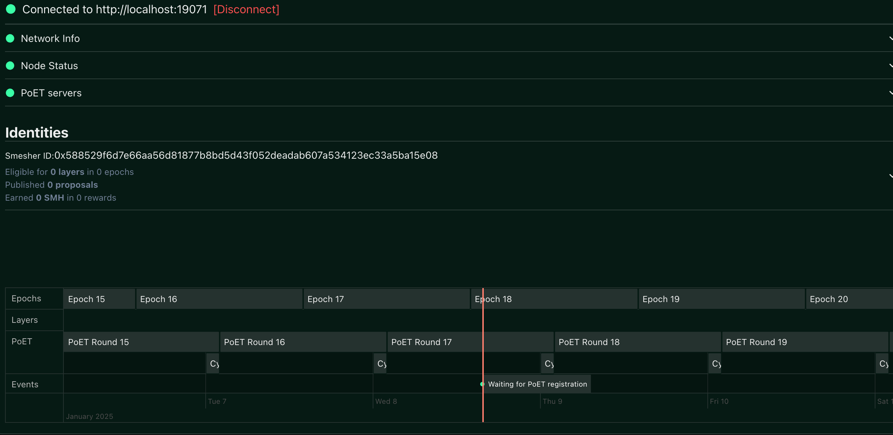
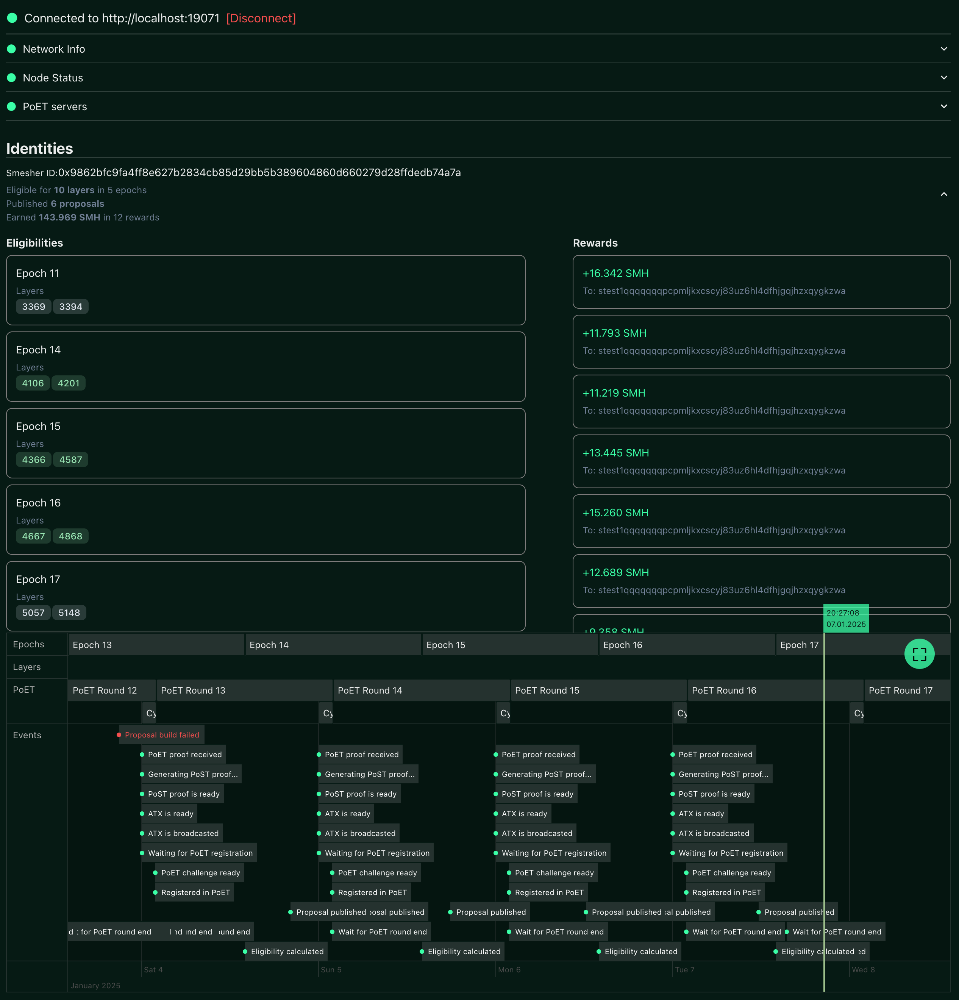

# Node split PoC

:::info

This is outdated information, Node split is now Beta and it is available [here](./node-split).

:::


In our ongoing effort to lower the bar for smeshing, we're exploring a new direction for reducing system requirements for smeshers. The idea is to re-architect the internal modules in go-spacemesh, isolating the smeshing logic from the passive consensus code. By dividing the node along these lines, we can enable users to run the lightweight yet sensitive (requiring access to the private key) smeshing logic separately from the rest of the node. This allows users with limited resources to use a remote node for their smeshing.

We demonstrate a PoC of the node split, where the smeshing logic is separated from the rest of the node. The PoC is based on the current go-spacemesh codebase and is intended to demonstrate the feasibility of the node split concept. The PoC is not intended to be a production-ready implementation.

The PoC itself is still a work in progress so please expect changes and improvement in the future.

The architecture of the PoC is as follows:


The PoC consists of two separate processes:
* `node service` aka node
* `smesher service` aka client

The easiest way to understand the setup is to try the PoC yourself. The following instructions will guide you through the process.


## Why is this important?

It's best to watch the [video](https://www.youtube.com/watch?v=d4jBz1krRHg) to get a better understanding of the problem and our reasoning behind the node split.

The current go-spacemesh node is a monolithic application that includes all the logic required for consensus, smeshing, and other services. This makes it difficult to run the node on low-resource devices, as the node requires a significant amount of resources to run. By splitting the node into two separate services, we can enable users to run the smeshing logic on a separate device, while still connecting to a remote node for the rest of the services. This allows users to run the node on low-resource devices, while still participating in the Spacemesh network.

### Benefits
1. **Lower system requirements**: Users can run the smesher service on low-resource devices while connecting to a more powerful node for the rest of the services.
2. **Better failover and redundancy**: Currently when you need to restart a node you also need to restart the smesher service. With the node split you can restart the node without affecting the smeshing process. Starting smeshing will be also much quicker because it will *not* need to wait for the node to sync or warmup in-memory caches from the DB as the node will be running elsewhere. Multiple smesher services can be connected to the same node, and nodes can be hot-swapped without affecting the smeshing process.
3. **Lower OpEx**: Smesher service can be shut down wherever not needed to save costs and resources. Additionally, only a single node is required for multiple smeshing services and it can run where it's the most cost-effective, which is not necessarily where the smeshing service runs.
4. **Better node maintainability**: The node can be updated without affecting the smeshing process and the smeshing service can be updated without re-syncing. This makes updates simpler and less risky.
## Running the PoC

There are two distinct configuration/setup methods possible:
1. Using locally running node and smesher service
2. Using remote running node and local smesher service

We will use a Docker Compose-based setup for both options. While it's possible to run the PoC without Docker, it's more complicated, so for simplicity, we'll use Docker.

Both setups will run two smesher services connecting to the same node. Please note that one smesher service can have multiple post services connected to it as is currently the case with node and post services. However, in this PoC we're using only one post service per smesher service.

### Using locally running node and smesher service

Please use the `docker-compose-testnet-both-local.yml` file for this setup.

The commands will be:
```
docker compose -f docker-compose-testnet-both-local.yml [...]
```

Since this will be a locally running node, it will need to sync with the network like all Spacemesh nodes. The testnet network is small, so the node should sync relatively quickly.


### Using remote running node and local smesher service

Please use the `docker-compose-testnet-remote-node.yml` file for this setup.

The commands will be:
```
docker compose -f docker-compose-testnet-remote-node.yml [...]
```

### Starting the setup

1. Clone the repository and switch to the `node-split-poc` branch
```
git clone https://github.com/spacemeshos/go-spacemesh.git
cd go-spacemesh
git checkout node-split-poc
```
2. Change the directory to the demo directory
```
cd activation_service_poc/demo
```
3. You should see the following files in the directory
```
docker-compose-testnet-both-local.yml
docker-compose-testnet-remote-node.yml
```
4. Run the docker-compose command according to your chosen setup. For example, to run the setup with remote node and smesher service, run:
```
docker-compose -f docker-compose-testnet-remote-node.yml up -d
```

After all the steps are done please give each smesher service a while to initialize POST and generate initial post proof. This may take up to a few minutes.

If all steps are followed correctly, you should see three new Docker containers running. You can check the status of the containers using:
```
$ docker compose -f docker-compose-testnet-remote-node.yml ps
NAME                                 IMAGE                                    COMMAND                  SERVICE                       CREATED          STATUS          PORTS
demo-activation-service-remote-1-1   spacemeshos/go-spacemesh-dev:2c898bb30   "/bin/go-spacemesh -…"   activation-service-remote-1   39 minutes ago   Up 39 minutes
demo-activation-service-remote-2-1   spacemeshos/go-spacemesh-dev:2c898bb30   "/bin/go-spacemesh -…"   activation-service-remote-2   39 minutes ago   Up 39 minutes
```

You'll also be able to connect to the node's UI by visiting `https://smesher-alpha.spacemesh.network/` in your browser. This is a PoC of the smesher service UI and is not intended to be a production-ready implementation. It uses the smesher service API directly to interact with the smesher service. It's fully open source and the code can be found [here](https://github.com/spacemeshos/smesher-app).

>[!NOTE]
If you're running on Mac with Apple Silicon you need to build the docker images yourself by running: `make dockerbuild-go` in the go-spacemesh repo.

The first time you open the UI it will be mostly empty as you're running a fresh smeshing service and therefore don't yet have eligibility. Testnet epochs are 24 hours long, so you'll need to wait for the next epoch to start smeshing. You can check the epoch number and exact timing in the UI.

Initially, it will look like:


After a few epochs, you should see a UI that looks similar to:



## Interacting with the PoC

The smesher service proxies v2 API calls to the node service. You can query the smesher service API to interact with the attached node. For example:
```
curl -X POST http://localhost:19171/spacemesh.v2alpha1.NodeService/Status
```
will return the node's status.

In addition to the existing v2 API, there is `spacemesh.v2alpha1.SmeshingIdentitiesService/States` which returns the list of smeshing identities and their detailed states.

>[!NOTE]
Please note that currently the state persistence is implemented with some simplifications. States persist across restarts but you will see some duplicates in the list of states. This is a known issue that will be fixed in the final implementation.


## Stopping the setup

To stop all the containers you can use the following command:

```docker compose -f docker-compose-testnet-both-local.yml down```


## Extra content

### What are these magic ports used in the docker-compose files?

All ports except the one ending with `99` are standard ports used in normal/current go-spacemesh setups. The port ending with `99` is used by the node to expose its API for the smesher service. This port number may change in the future, as it was selected specifically for this PoC.
These different APIs will likely be combined under the same endpoint later, but for simplicity and flexibility they are separated in this PoC.

### What about the `--json-cors-everywhere` flag?

This is a new flag introduced for the PoC. It configures the node to add CORS headers to all responses, which allows the browser-based UI to query the smesher service API.
While this is not a final solution and will be replaced with a more secure one in the future, please note that this API does not expose any sensitive data.

### Running the PoC without Docker

Use the attached configs, replicate the command line, and run the binary files:

1. Download the most recent release of node-split-poc go-spacemesh from the [releases page](https://github.com/spacemeshos/go-spacemesh/releases) and look for `node-split-poc` releases.
2. Extract the archive and copy the config files (*.json)
3. Run the binary or binaries using the same commands specified in the docker-compose file.


### Why the config is that big?

The actual differences to the default config are pretty minimal.

The most important is the addition of `"node-service-address": "http://0.0.0.0:9099"` in the `main` section, and the definition of `"grpc-local-services": ["smeshing_identities_v2alpha1"]` in the `api` section.
