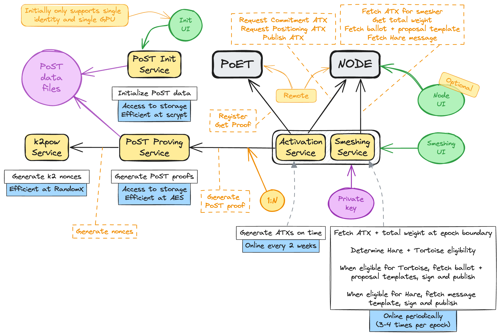

# Node split

Node split is currently considered a Beta feature that is stable enough to run on the mainnet.

In our ongoing effort to lower the barrier for smeshing, we're exploring a new direction for reducing system requirements for smeshers. The idea is to re-architect the internal modules in go-spacemesh, isolating the smeshing logic from the passive consensus code. By dividing the node along these lines, we can enable users to run the lightweight yet sensitive (requiring access to the private key) smeshing logic separately from the rest of the node. This allows users with limited resources to use a remote node for their smeshing.

The Node split is still a work in progress, so please expect changes and improvements in the future.

The architecture is as follows:

The Node Split consists of two separate processes:
* `node service`
* `smeshing service`

## Why is this important?

It's best to watch the [video](https://www.youtube.com/watch?v=d4jBz1krRHg) to get a better understanding of the problem and our reasoning behind the node split.

In the current architecture, one can optimize operations by running node, post-service, and k2pow-service to properly balance specific service performance requirements. However, when smeshing, it was not possible to split the smeshing operation from the consensus and p2p logic. Node-split enables this last crucial capability that will allow for further optimization.
Moreover, even if one is running a monolithic go-spacemesh node (default mode) with node-split setup, users can run the smeshing logic on a separate device while still connecting to a separate node to save on costs and resources.

### Benefits
1. **Lower system requirements**: Users can run the smeshing service on low-resource devices while connecting to a more powerful node for the rest of the services.
2. **Better failover and redundancy**: Currently, whenever you need to restart your node, it takes a long time because it needs to re-sync, warm up large in-memory caches, etc. With node-split, you can restart the node without affecting the smeshing process. Starting smeshing will also be much quicker because it will *not* need to wait for the node to sync, as the node will be running elsewhere. Multiple smeshing services can be connected to the same node, and nodes can be hot-swapped without affecting the smeshing process.
3. **Lower OpEx**: The smeshing service can be shut down when not needed to save costs and resources. Additionally, only a single node is required for multiple smeshing services and it can run where it's most cost-effective, which is not necessarily where the smeshing service runs.
4. **Better node maintainability**: The node can be updated without affecting the smeshing process and the smeshing service can be updated without re-syncing. This makes updates simpler and less risky.

## Running the Node Split

There are two distinct configuration/setup methods possible:
1. Using a locally running node and smeshing service
2. Using a remote running node and local smeshing service

Wherever the `node` is mentioned, it means the node service. It's basically a normal go-spacemesh node with proper version and API exposed.

#### Smeshing service

For convenience, we're hosting an example config smeshing service:
* Mainnet compatible config for smeshing service: https://configs.spacemesh.network/config.mainnet-smeshing-service.json

As you can see, the config for smeshing-service is a stripped-down node config. The essential part is the `api` section. As of now, any valid node config is a valid smeshing-service config IF the `api` section is altered to match the config shared above.

#### Node service

Please note that we're NOT providing example configs for node-service for mainnet as all that's needed is to enable one additional API endpoint.

Node-service is just a full Spacemesh node with two exposed APIs. As mentioned above, smeshing-service needs to connect to the node-service API endpoint and v2 API endpoint. Therefore, the matching configuration is `--node-service-listener`.
We highly recommend setting up the `grpc-json-listener` as well, as then this node can be used as a source in proxy in smeshing-service.

`--node-service-address` is a URL to the node-service API endpoint on *any* synced node in the given network.
`--proxy-api-v2-address` is a URL to the v2 API endpoint on *any* synced node in the given network. It's needed by integrations to query the node-service API directly via the smeshing-service. Smeshing-service then acts as a middleman and relays the requests to the node-service API endpoint. That's why we're recommending here to use the normal publicly available mainnet-api.

#### Other than mainnet configs

We're also sharing non-mainnet configs.

* Devnet3 compatible for node service: https://configs.spacemesh.network/config.devnet3-node-service.json
* Devnet3 compatible for smeshing service: https://configs.spacemesh.network/config.devnet3-smeshing-service.json

This network is currently live and it's having epoch duration of 2h.

### Versions compatibility

There are no protocol-related changes in the node split implementation. A node split release is compatible with the devnet/testnet and with the specified go-spacemesh version mentioned in the release notes of the node split release.

Currently, we're releasing node split as `node-split-{semver-here}` and go-spacemesh compatibility will be mentioned in the release notes of the node split release.

## Migration from node to node-split setup

To migrate from an existing node to node-split setup, you need to follow these steps:

1. Stop the existing node.
2. Backup all local.sql* files.
3. Edit the configuration by adding the required flags as listed above (`node-service-address` and `grpc-json-listener`)
4. Start the smesher-service as you'd start a normal go-spacemesh node just by adding `smeshing` as the first argument: `go-spacemesh smeshing <other arguments>`
5. If you're satisfied with the setup, you can delete all state.sql files since the smeshing service does not need the whole state. However, note that the smeshing service will recreate state.sql files and keep the data it needs to operate, but it will maintain only a minimal subset of the data.

:::note

Because in the normal go-spacemesh node the events are NOT persisted, you might have partially wrong state reflected by the `spacemesh.v2alpha1.SmeshingIdentitiesService/States` endpoint. This is only cometic issue and will *NOT* affect the rewards etc.

:::

### Accessing the hosted node-service

For convenience, we're hosting the public node-service that runs against mainnet that you can connect to by setting up the following
* `--node-service-address` to `https://mainnet-node-service-api.spacemesh.network`
* `--proxy-api-v2-address` to `https://mainnet-api.spacemesh.network`
flags when running your smeshing-service.

:::warning

This service is provided with no warranty. Support is available only through standard Discord channels.
Please use at your own risk.

:::

### Where is the UI

As mentioned previously, there is a next-gen UI called smesher-app fully open-sourced and available on Github. You can find it here: https://github.com/spacemeshos/smesher-app

Anyone can run that UI as it only requires a browser and a connection to the node split.

For convenience, we're hosting the publicly available instance at [https://smesher-beta.spacemesh.network](https://smesher-beta.spacemesh.network) It does NOT communicate with ANY servers other than the ones that you specify. It talks to your local APIs only.

When opening, please specify the URL to the `--grpc-json-listener` specified on the smeshing service.

This UI uses ONLY the JSON API endpoint and communicates fully over http(s).

And because a smeshing-service by default also uses the proxied v2 API endpoint, there is no need to specify a node endpoint in the UI.

## Q & A

#### Do I need to run node-split based setup?

Definitely not. If you currently run a Spacemesh node and you're happy with it, you can keep it running. That's still a supported option.

#### Can I actually use *any* go-spacemesh node as my smeshing-service?

Yes, any node can be migrated to smeshing-service setup. To do so, please follow the migration instructions.

#### I have 10s of nodes what would be my setup?

If you're currently running multiple nodes to scale your operation, the safest optimization is to run 2-3 nodes as your full nodes and convert all other nodes to smeshing-service nodes.
This will allow you to update nodes without interrupting the smeshing operation (submitting proposals etc).
Additionally, you will also benefit from:
* reduced total state DB size
* reduced total CPU usage
* reduced total memory usage

#### Can I use a load balancer to add HA to the setup?

Yes.

#### Who keeps the network state?

In a node-split situation, it's the node which keeps the network state. Smeshing-service will ask the node for any information needed to perform its duties (publishing proposals, hare participation etc).

#### Does the hosted UI use only my smeshing-service?

Yes, hosted UI *never* connects to anything else than your specified smeshing-service json-rpc api address.

#### Can I run the UI locally?

Yes absolutely, please refer to the smesher-app readme located at [Github](https://github.com/spacemeshos/smesher-app).
