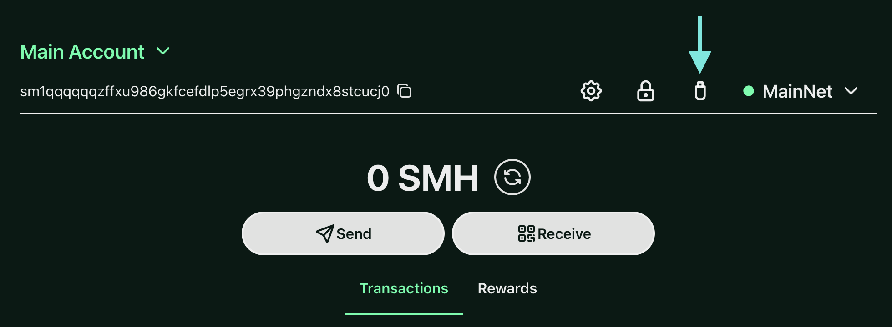
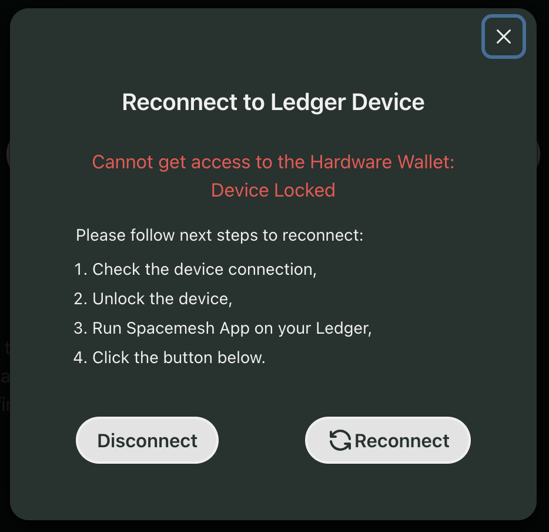
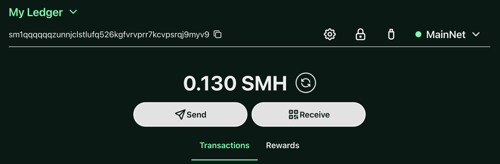
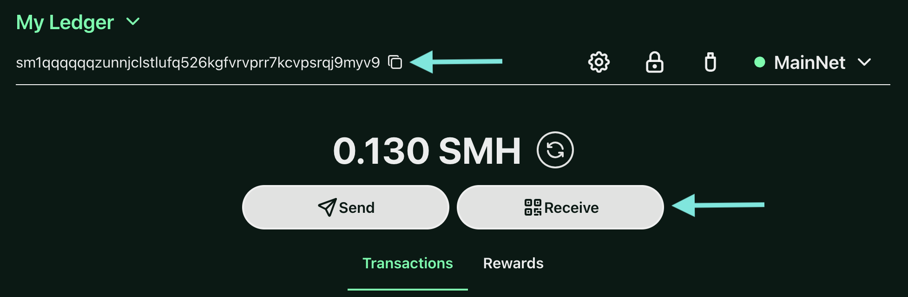

## How to use your Ledger device with the Spacemesh Wallet

A Ledger device is a highly secure hardware wallet designed to safeguard your digital assets. By generating private keys offline, it significantly enhances the security of your cryptocurrencies, making it a popular choice among crypto enthusiasts who prioritize safety.

Ledger devices work seamlessly with various cryptocurrency wallets, including the Spacemesh Wallet. This integration allows you to manage your SMH funds securely, combining the robust security features of hardware wallets with the user-friendly interface of software wallets. Connecting your Ledger device to the Spacemesh Wallet ensures that your private keys remain protected within the Ledger's secure element chip while allowing you to interact with your funds through the Spacemesh Wallet.

### **Before you start, please make sure**

1.  You’ve [initialized](https://support.ledger.com/article/4416927988625-zd) your Ledger device.

2.  The latest firmware is [installed](https://support.ledger.com/article/4445777839901-zd) (Ledger Nano S plus).

3.  Ledger Live is [ready to use](https://www.ledger.com/ledger-live).

4.  You can use [https://wallet.spacemesh.io/](https://wallet.spacemesh.io/) or build the Wallet from [Github repository](https://github.com/spacemeshos/smapp-lite/)

### **How to install the Spacemesh app using Ledger Live**

1.  Open the Manager in Ledger Live.

2.  Connect and unlock your Ledger Device.

3.  If asked, follow the onscreen instructions and Allow Ledger Manager.

4.  Find Spacemesh app in the app catalog.

5.  Click the Install button. 

    *   An installation window will appear. 

    *   Your device will display Processing… 

    *   The app installation is confirmed.

    

6.  Close Ledger Live.

### **Connect to the Spacemesh Wallet**

1.  Connect and unlock your Ledger Device. 

2.  Open the Spacemesh app on your Ledger Device.

3.  Open the Spacemesh Wallet website [https://wallet.spacemesh.io/](https://wallet.spacemesh.io/) 

4.  Create a Wallet account.

5.  Click “Connect Ledger” button

  

6.  Select a device which you have (Ledger Nano X or Nano S or S Plus):

:::note

You will NOT see **STEP 7** in cases where **STEP 6** worked correctly on the first try. If you connected on your first try, skip to **STEP 9**.

:::

7. If you failed to connect the first time, the next step is to check all requirements:

8.  If all requirements are met click the Reconnect button.

9.  The next step is to click “Settings” button

10.  And select “Manage keys & accounts”

11.  The next step is to click “Import from Ledger”

12.  You can give a custom name for your Ledger device and after that confirm operation by your password

13.   There is a public key, imported from your Ledger device

14.  You can select your Ledger device by clicking on the “Switch” button

15.  Your Ledger device is connected to Spacemesh Wallet and you will see your Ledger account address

16.  Please make sure that the address is identical to the address on your Ledger device.

### **View account balance**

1.  On the previous step you connected your Ledger device and the balance is shown under the address:

### **Receive SMH**

1.  You can get your Receive address by simply copying the address to the clipboard or by scanning the QR Code after clicking on the button “Receive”.

2.  Please make sure that this address is identical to the address on your Ledger device.

3.  Once you have sent SMH from another Wallet, you will see it in your transaction history and your SMH balance will be updated.

### **Send crypto assets**

1.  To send SMH to another Wallet please click “Send” button and insert the address where you want to send funds and the amount of SMH which you want to send. Click the “Next” button.

2.  On the next screen make sure that Destination address is the one where you want to send funds and that you sign the transaction with your HW Wallet. After that click the button “Sign & Publish”.

3.  Please review your transaction on your Ledger device

4.  Make sure that Destination address and Amount are correct:

5.  If everything is correct, accept the transaction on the Ledger device. If you noticed that something is wrong, please reject the transaction on the Ledger device.

### **Support**

The main Spacemesh support channel is [Discord](https://chat.spacemesh.io/).
