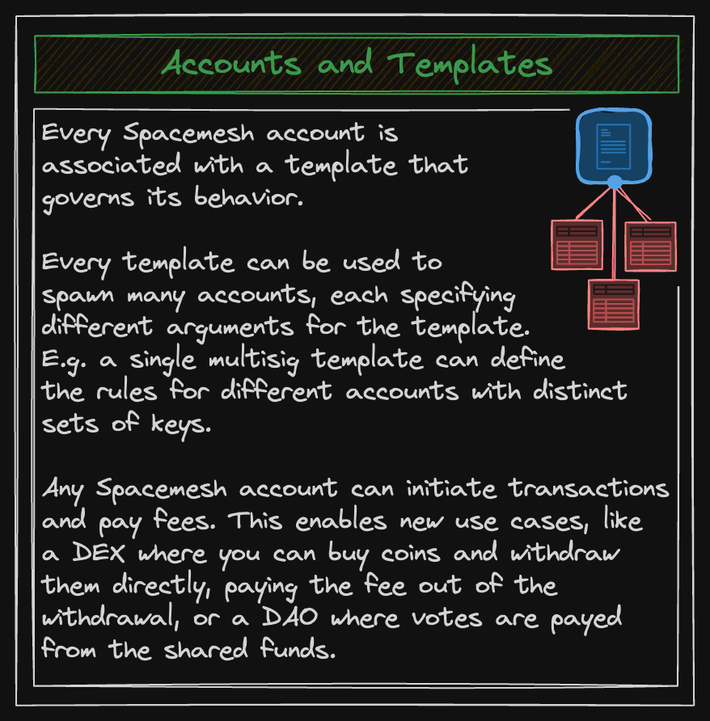

Spacemesh implements a form of native account abstraction (a.k.a., account unification): all accounts are smart contract-based accounts. There are no keypair-based "externally owned accounts" (EOAs) as in Ethereum.

An account has an address (24 bytes long, typically expressed as a [bech32](https://en.bitcoin.it/wiki/Bech32) string starting with `sm1` for mainnet and `stest1` for testnet), a template address, a nonce, a balance, and state. The template contains the smart contract's code; as of now there are no user-deployed smart contracts and no code stored inside account objects, there's only a short set of hardcoded "precompiled" templates (see [below](#accounts-1)).

A "stub" account has only a balance, no template, nonce, or state. This is simply an account that's received one or more inbound transactions but hasn't been spawned yet. The "spawn" operation occurs when the owner of the account reveals the template address and immutable state used to generate the address (i.e., the account preimage). A simple or multisig wallet must be spawned (i.e., the Spawn method must be called) before funds can be spent (i.e., before the Spend method is called).

Any account with a balance can pay for any transaction. The account that pays for a transaction is known as the "principal" of the transaction. Typically a wallet account serves as the principal for its own transactions, but more complex arrangements are possible including multisigs and applications that pay for user transactions.
