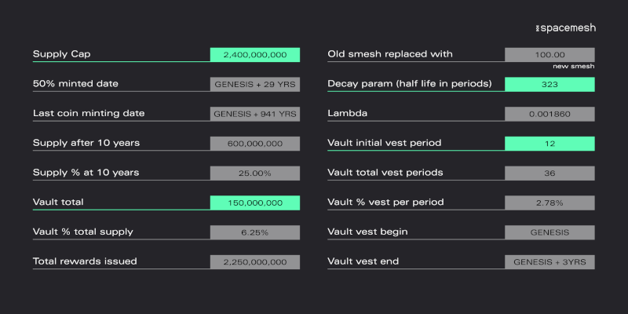
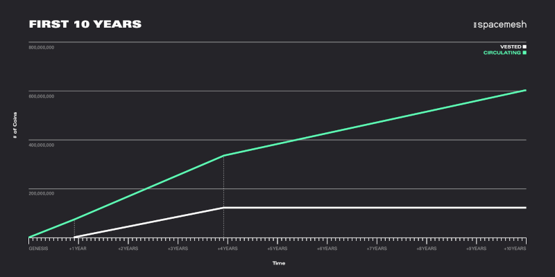
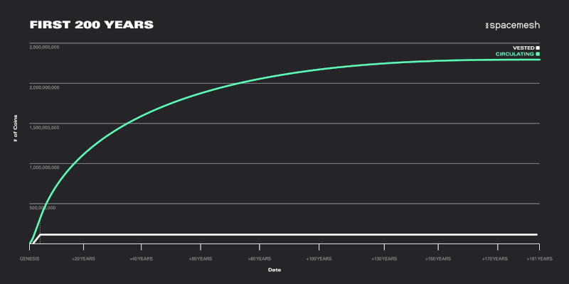

## Big Picture

Like Bitcoin, Smesh—the Spacemesh native coin—will be issued over time according to an exponential decay function with a hard supply cap. Issuance will be roughly 7.3x more gradual than Bitcoin, with a half-life of around 29 years. At ten years post-genesis, 25% of total issuance up to that point will be reserved for early investors and builders. However, issuance will continue for a long, long time after that, and eventually this share will fall to 6.25% of total supply. The remaining 94.75% will be issued permissionlessly to Smeshers (Spacemesh miners). Spacemesh does not have a traditional premine: on the day the network goes live, and for the first year thereafter, zero coins will be issued to early supporters. **The only coins in circulation and tradable for the first year are those that were mined permissionlessly by Smeshers.**

## Issuance

Rather than having abrupt “halvenings”, Spacemesh issuance decays predictably and gradually with every layer. The second is that, whereas Bitcoin has a half-life of about four years, the half-life of Spacemesh issuance will be about 29 years. This means that, while the last full Bitcoin will be issued around 2140, the last Smesh coin will be issued hundreds of years after genesis, in around 2899. The third is that a small portion of Spacemesh issuance, 6.25% of the total, flows into “vaults” for early investors and builders, with multi-year vesting.

## Premine?

In the name of transparency and accountability, it’s very important that the entire community understands how the project’s earliest supporters are compensated. The most important thing to know is that, as described above, Spacemesh does not have a traditional premine: **on the day the network goes live, and for the first year thereafter, zero coins will be issued to early supporters.** The only coins in circulation and tradable for the first year are those that were mined permissionlessly by Smeshers.

All of the coins granted to early supporters are subject to a four year vesting schedule. At the launch of the network, we will lock 150M coins into smart contracts called Vaults that are owned by the project’s early investors and core team. These coins will begin to vest after one year. For the following three years, these coins will slowly unlock, and they will be fully vested and spendable at the four year mark.

Ten years post-genesis, these coins will represent 25% of total issuance up to that point. Since issuance will continue for a long, long time after that, this share will eventually fall to 6.25% of the supply cap.
