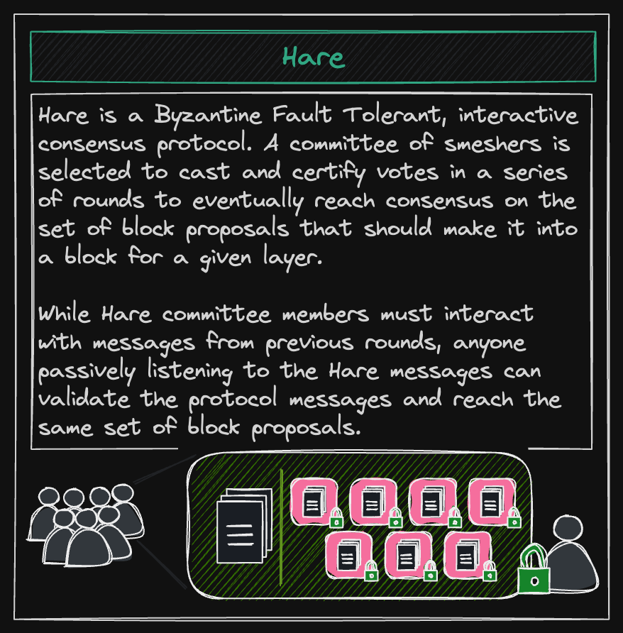

Every five minutes the Spacemesh network fires a _layer tick._ The timing of this event is calculated locally, which is why it is critical that all Spacemesh nodes have synchronized clocks. After the layer tick event, there is a short delay after which the [[Hare]] consensus process kicks off for the layer that just ticked. The active set (i.e., the set of all valid Activation Transactions (ATXs) targeting the current epoch that a node is aware of) is sampled and a random committee of eligible, active smeshers is chosen to participate in the next Hare round. This sampling occurs relative to each smesher's **weight** in the current epoch, such that nodes with a greater weight are chosen more often. These nodes broadcast messages containing their opinion, or view, of the valid, ordered set of transactions to be included in this layer, and through several rounds of exchanging messages they eventually reach consensus on the canonical set of transactions for this layer. At the end of a successful Hare instance, all honest participants agree on the set of transactions to be included in the layer, and all honest nodes that observed Hare (but didn't themselves participate) also agree on the same. As a result, all nodes are able to independently construct a block containing these transactions in the canonical order.

Note that **there are currently no rewards for participating in Hare,** but we intend to change this soon.

