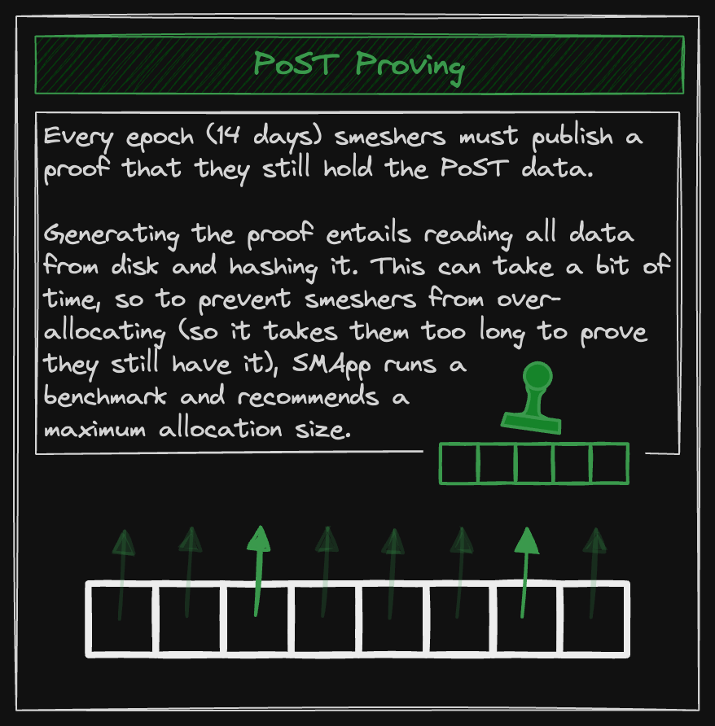
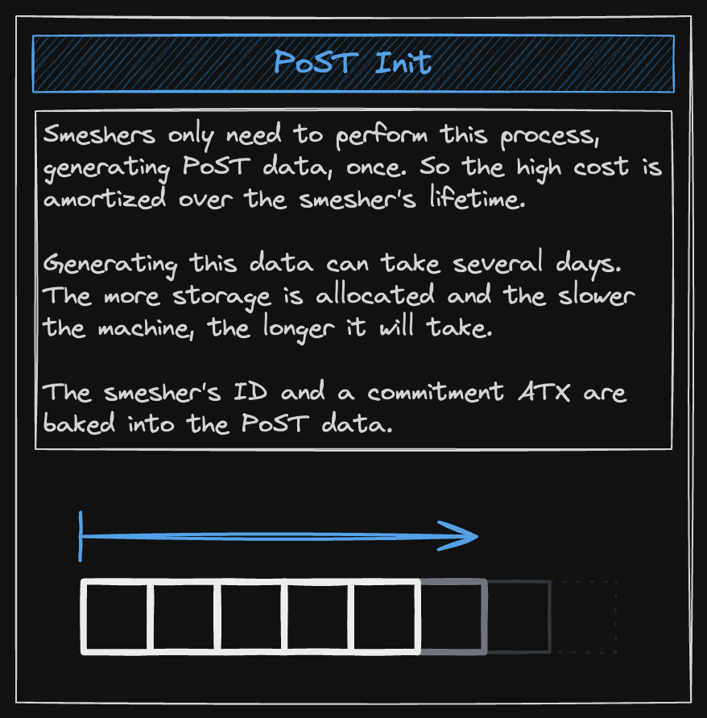
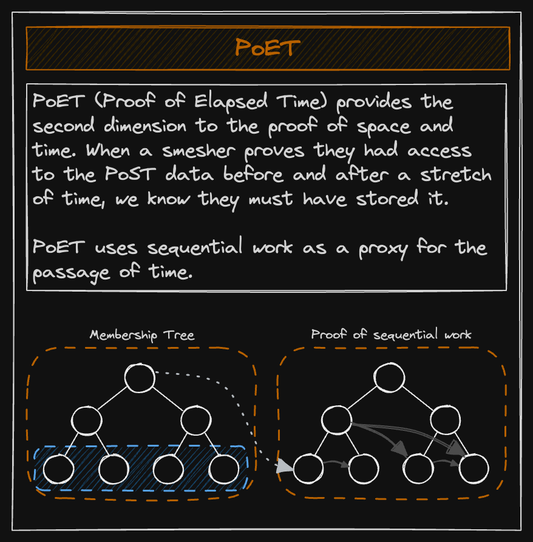

The Proof of Space Time (PoST) is a cornerstone of the consensus algorithm used by the Spacemesh protocol. Put simply, PoST is used to ensure that a smesher reserves a given amount of storage space for a given period of time. In this blog post, we will explore PoST along with its various constituents. In the end, you should have a good understanding of what PoST is, what it does, and how it works.

### Introduction

In any distributed ledger network, the primary goal is for all the participants to agree on a single state of affairs. As such, all nodes would agree that a specific record of transactions is the correct one and everyone should record new transactions on it. One simple way to achieve this could be to allow each participant a single vote and have everyone vote on the state of the blockchain ledger. However, this is a naive solution.

On the blockchain, identity is cheap. Anyone can create multiple wallets and thus get multiple votes. This phenomenon is also known as a Sybil attack, whereby one person can masquerade as many on a given network. One way to counteract this problem is to require a real-world resource to be able to vote. As an example, the protocol rules can specify one vote per CPU, and assuming all CPUs have similar processing power, if each participant has one CPU then that can be used as an analogy for one participant and the base voting unit.

In this scenario, one person can have multiple CPUs but buying a lot of CPUs is not cheap. In addition, if the honest participants are encouraged to buy more CPUs and work as honest nodes, this further discourages people from using their CPU power in a malicious way. The Bitcoin Sybil resistance mechanism works in a similar manner. Using this approach, while we have mitigated Sybil attacks to a large extent, some problems with this solution still persist: CPU usage is energy-intensive and thus not environment friendly. In addition, people will ultimately form pools and resort to using ASICs in order to increase their chances of getting to participate in the consensus mechanism.

In light of the above, the Spacemesh protocol opted to use an alternative physical resource: hard drive space. Just like CPUs, hard drives cost money and thus are a viable way to counter Sybil attacks. However, unlike energy intensive processing using CPUs, Spacemesh only requires the participant (called a smesher) to store some data on the disk for a specific amount of time, and then prove that said data was on disk for said amount of time. This is the Proof of Space Time.

## Proof of Space

At this point, we know that a smesher must store some data on disk for some amount of time. However, what is this data? And how does one prove that one has stored this data for a specific amount of time? Let us consider an example: In an interactive setting, if Bob wants to verify whether Alice has some data stored on disk at a particular location, Bob can ask Alice to fetch that data from that location and show it to Bob. Alice then goes to that location on the disk, fetches the data and shows it to Bob. Given that the data is deterministic, Bob can then regenerate this data and verify that it is the same as the one Alice sent to Bob.

One problem with this proving and verification mechanism is that instead of storing the data and then fetching it for Bob when asked, Alice can just regenerate it. Furthermore, Alice can just only generate the data for the location that Bob asked, which allows Alice to not store the entire data and just regenerate the piece of data for the location that is asked. This allows Alice to use their hard drive space for other purposes and then when Bob asks for the data at a given location, Alice can just regenerate this data. As such, there need to be measures in place which ensure that a smesher is not able to easily regenerate the required data and keeps the data stored on-disk until the proof is required.

Spacemesh solves the selective data regeneration issue by having the smesher not just require the data stored at some location on the disk, but also by making said data hard to generate. The smesher has to go through all the data on disk, perform a special calculation on it, see if each calculation output is below a certain threshold, and maintain a list of all the successful results. This data has been made expensive to generate but at the same time deterministic as well.

This means that the data can be regenerated from the same set of inputs from which it was originally created. This property is helpful when the verifier wants to regenerate the data to perform the proof verification. Now, if a smesher does not want to keep the data and instead chooses to regenerate it later when posting the proof, the smesher would need to regenerate the entire data, which would prove to be more expensive than storing it.

### Generating the Data

In light of the above, Spacemesh uses the Scrypt hashing function for data generation purposes. The function is configured in such a way that makes it neither too difficult nor too easy to run. This balancing act is necessary so that both the smesher and the verifier have a not-too-tough time running it and generating/regenerating the data.

Scrypt is used to fill the allocated amount of disk with some predetermined data. An index value (called the label index), the smesher’s public key, and some other data is used as input to the function. The output is a 32-byte hash, the first 16 bytes of which (called a label) are stored on the disk as a unit. This process is repeated to generate labels and store them on the disk until the allocated space is filled. This process is called the initialization process and can take from about 48 hours to several days based on allocation size and GPU speed.

### Finding the Target Labels

Once the data is generated and stored, the next step is to use a hash function to find a set of values that are below a given threshold. This step is important as we want the smesher to store the entire data on disk and not one or a collection of values. So, we make a smesher sequentially input the stored labels into another hash function and find a set of hashes that satisfy the threshold. At the moment, the amount of hashes needed to constitute the Proof of Space (PoS) is 37.

This second hash function cannot be Scrypt since we do not want an expensive calculation this time around. One example we can go with is SHA256, but this algorithm, while good for hashing large pieces of data, is not efficient at hashing many (e.g., billions) of small pieces of data. Since our minimum space allocation is over 17 billion labels, SHA256 would not be suitable for hashing them as invoking it billions of times just takes too long.

Taking a deeper look at SHA256, we can see that it performs two major operations: writing the input data into the hash data structure, and then summarizing it to get a hash value. It is the second part, the summarization of data, that took a lot of time when called billions of times. Thus, any alternative algorithm that is also efficient at summarizing small batches of data, is what is needed. The AES encryption algorithm turns out to have the property we are after: it supports block mode, whereby it can efficiently be called on many batches of small data (blocks) and each encrypted block is independent. Like hashing, encryption is a one-way-function that results in output that can’t be traced back to the preimage. Like SHA256, AES is highly optimized in modern processors, so it’s very efficient to perform. As such, AES encryption is what Spacemesh uses for finding the target labels.

### Generating the Proof

In order to generate the PoS, we take each label, concatenate it with a challenge value and a nonce value, and encrypt it using the AES encryption algorithm. The encryption output is thereafter taken to be a “hash”. In the initialization process, the challenge value is taken to be 0. The aim is to find a set of encryption outputs that are below a certain threshold.

### Threshold

The threshold is the target value which every encryption output must be below in order to be a success. Currently, the expected number of outputs which are below the threshold for every nonce is 26. However, since multiple nonces are tried in parallel (288 nonces by default, this can be reconfigured), at least one nonce is expected to result in 37 or more encryptions that are below the target threshold.

The threshold depends on the amount of disk space allocated, so if the minimum of 256 GiB (or four Space Units) has been allocated, the requirement for the proof is for there to be 37 outputs below the threshold. Encryptions are repeatedly generated until we have a list of indexes of the labels that are below the threshold. This list of indexes along with the nonce constitutes the PoS.

## Proof of Elapsed Time

So far, we have generated a proof which shows that we reserved some space with some special data (i.e., the labels). As per the protocol requirements, this data needs to be present on the disk for one epoch, which is about two weeks. We now need to generate a different proof which proves that all the labels spent an epoch stored on the disk. This is the Proof of Elapsed Time (PoET).

The PoET is generated by a PoET server, which employs sequential calculations to measure the passage of time. Such work cannot be parallelized and must be performed sequentially, using the previous output as the input for the next iteration. The number of sequential calculations performed gives us the tick count, which is then used to approximate elapsed time. The higher the tick count, the more time has passed.

### Proof Generation

The PoET generation process starts by storing a reference to the PoS that was generated earlier in a Merkle tree called the membership tree, and then using the PoS as input value and performing sequential calculations on it. The nature of the calculation algorithm is such that it is not parallelizable and thus only a single CPU core can be used to run it. Let us understand this in a bit more depth.

The process runs for a period of 2 weeks, minus 12 hours. This 12-hour period is called the cycle gap and exists to give smeshers some time to participate in the upcoming PoET generation cycle. Once this process is completed, the PoET is output. After a smesher participates in a PoET cycle by submitting a valid PoS, he is then able to participate as a smesher in the epoch following the next one. In this way, a smesher is able to become eligible for participating in all upcoming epochs by entering the PoET generation cycle on time.

### The Process

A Merkle tree and recursive hashing is leveraged to generate the PoET. First, the initial PoS is hashed using the SHA256 algorithm and stored as a leaf in a Merkle tree. The second leaf (sibling to the first leaf) is the SHA256 hash of the first leaf and the initial PoS. The second pair of leaves then hashes its left pair of sibling leaves’ parent node (which is a hash of the concatenation of the first sibling leaves). This process is repeated until the requisite number of calculations is performed and a period of 2 weeks is approximately spent doing this.

Finally, the Merkle root is fed to a special algorithm which outputs a set of indices. The verifier sees this set of indices and tries to recreate the Merkle root using the values present at these indices (along with some other leaf and node values). The prover similarly inputs the root into an algorithm, and if the algorithm outputs the same set of indices, it is understood that a certain number of ticks have definitely been performed since the initial PoS was constructed. This gives us our PoET. However, owing to the nature of how the PoET is calculated, it happens to be that the rightmost leaf in the Merkle tree and its parents are not hashed and stored in any other leaf. This allows a smesher who controls a PoET server to perform something called Grinding.

## Grinding

Consider a smesher who also runs the PoET server. At the end of an epoch, he will have a PoET proof for the amount of space he allocated two weeks prior. Now, since he also controls the PoET server, he can simply change the last leaf’s value by 1 bit and see if the set of indices derived from the changed Merkle root include this leaf or not. If they do, then he retries until such a set of indices is derived which does not include this leaf. This way, he will have in possession multiple valid PoET proofs for the same space reserved. One may ask, how is it useful to have multiple PoET proofs?

Remember that PoET is used as the challenge value when calculating the later PoS. So, when finding the encryption outputs which meet the target threshold, the PoET value constitutes one of the encryption inputs. Thus, a smesher with multiple PoET values can keep using a different PoET value and find encryption outputs which are below the threshold. The normal smesher who does not control a PoET service only has access to one PoET proof and is limited to only one encryption output.

Given the current design of the PoET and owing to the nature of grinding, it is near impossible to prevent it. Thus, instead of disallowing Grinding, Spacemesh decided to allow everyone to try different nonce values when generating encryption outputs and try to find the target labels. As such, the nonce plays the role of leveling the playing field and giving every smesher the ability to keep “grinding” for the requisite number of encryption outputs meeting the threshold.

### Nonce

The reason for requiring a nonce value in the encryption process is two-fold: firstly, it guarantees that the smesher will find enough labels that satisfy the threshold, thereby helping them successfully create the proof. Secondly, as we learned above, without the nonce, a smesher with a powerful machine can try different PoET values concurrently to try and find the required target labels. In this scenario, requiring a nonce value to find the target label would even out the playing field and grant everyone a chance to find the target amount of labels in a relatively short period of time.

However, even with the nonce requirement, a smesher with access to a powerful machine can try a large number of nonces in parallel and thus find enough labels below the threshold without allocating the complete required disk space. As such, someone with an ASIC can try 5000 nonces in parallel but allocate, for example, 90% of the disk space required to find the target number of nonces. Thus, even with a nonce value, the smesher with the powerful machine gets an advantage.

The solution to this problem was to introduce the requirement of doing some computation for each new nonce value generated. The work here entails hashing several values together in order to get the nonce value. The k2PoW algorithm is used to perform this task: the challenge value, nonce value, and the smesher ID are hashed together which results in the nonce value.

## Proof of Space Time

Now, the PoS submitted by the smesher needs to be verified using the subsequently generated PoET. As we know, the PoS is actually the list of all the labels that had satisfied the threshold requirement when encrypted along with some other data. The proof verification process is identical to the proof generation process, with one key difference: the challenge value, which was taken to be 0 for the initial PoS generation process, will be taken to be the PoET value for the later PoS generation and verification process.

### Proof Verification

The verification process starts by once again calculating the threshold for the list of labels (the PoS). Then, the labels are regenerated using the same input values as earlier (in particular the label indexes) and are fed to the scrypt hashing algorithm. Afterwards, each 16-byte label that was regenerated is concatenated with the challenge value, which is the PoET output this time. The encryption is performed again and the encryption outputs are then once again verified against the threshold. Finally, if there are as many valid label encryptions as there were the first time around when the PoS was initially generated, the proof has successfully been verified and the smesher is allowed to participate in the epoch after the next one.

The PoS generation, the PoET generation, and the later PoS generation and verification, taken together, form the Proof of Space Time.
