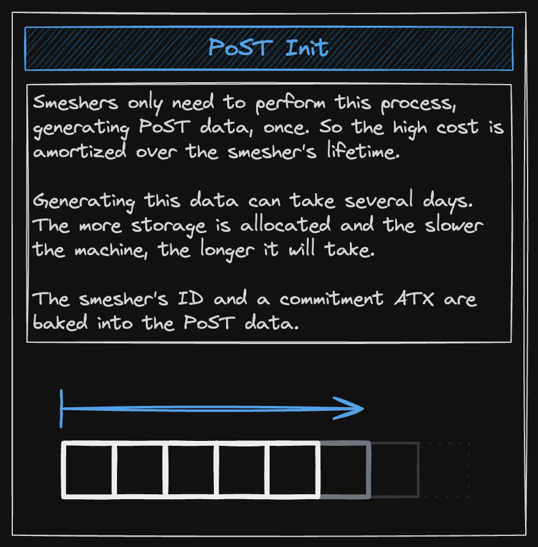
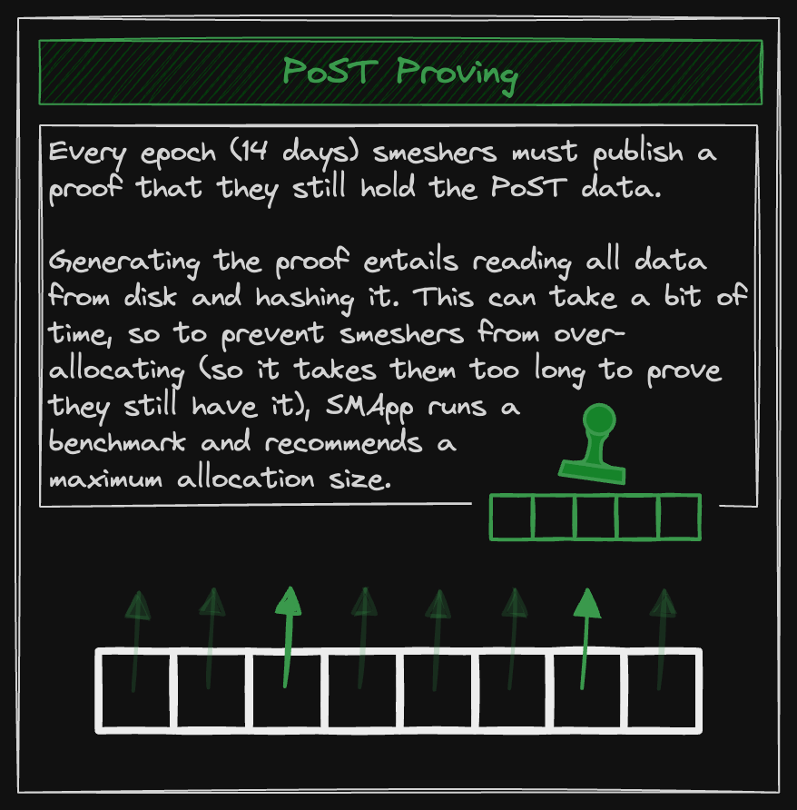

In order to become eligible to mine coins, miners of cryptocurrencies need to prove that they’ve expended a scarce resource in service of the protocol. This is what we call the “consensus mechanism”. You may already be familiar with the most famous of these, Proof of Work, where miners must cryptographically prove that they’ve done the expensive work of  solving extremely complex math problems (this is, in effect, how Bitcoin mining works).

Proof of Space-Time is another kind of consensus mechanism, but rather than rely on the computationally expensive “work” that Bitcoin-style proof of work relies on, it instead relies on the resource of storage space. More specifically, the smesher (Spacemesh miner) must prove that they’ve committed a specific amount of storage space over a specific period of time, and used that storage space for nothing other than Spacemesh mining.

## Initialization Phase

Spacemesh is a permissionless blockchain, and one of the risks of making a blockchain permissionless is that it exposes the entire network to malicious actors that wish to attack it. Some attacks may include a small number of participants trying to fool the system thar they have more voting power than they actually do. These kinds of attacks are called **Sybil attacks**: the ability to forge multiple identities and use them to skew consensus or otherwise attack the network.

In order to overcome Sybil attacks in a permissionless network, miners need to prove they have incurred some cost in order to participate—i.e., they need to earn their eligibility.

Spacemesh deals with this problem through the initial production of “Proof of Space Time data”—unique “nonsense” data that is used to fill up the allocated storage space. This one-time process is costly, requiring a GPU to be done efficiently, and that’s what makes it essential for the security of the network. If this step wasn’t in place, then the Spacemesh network would be vulnerable to the types of Sybil attack outlined above. Note that, while a miner is free to erase these data, reuse the storage space for another purpose, and only regenerate the data when needed to prove participation, no rational actor would do this since regenerating the data is designed to be much more costly than just storing it in the first place.

This brings us to the next phase.

## Execution Phase

Once an epoch, during the execution phase, the smesher will prove that she still has access to the PoST data generated during the initialization phase. The smesher generates a challenge based on a deterministic, predictable process, and if their PoST data satisfies the condition of this challenge—by providing random piece of that data—then she can successfully generate a Proof of Space in response to the challenge.

### NiPoST

So far, we’ve only talked about the Proof of *Space* aspect of the consensus mechanism, but the *time* aspect is just as important. And that’s where NiPoST comes in. A NiPoST (which stands for non-interactive proof of space time) must include a Proof of Space—generated in the execution phase—but also a Proof of Time. The generation of this proof is explored in Proof of Elapsed Time (PoET). The short version is that the initial challenge of the first execution phase is used as the input to a Spacemesh time server—PoET—which in turn uses this challenge in a process known as “proof of sequential time” to create the seed for its Proof of Elapsed Time. This proof that the required time condition has been met is then transmitted to the entire network, and used to construct the NiPoST (along with the PoS).

