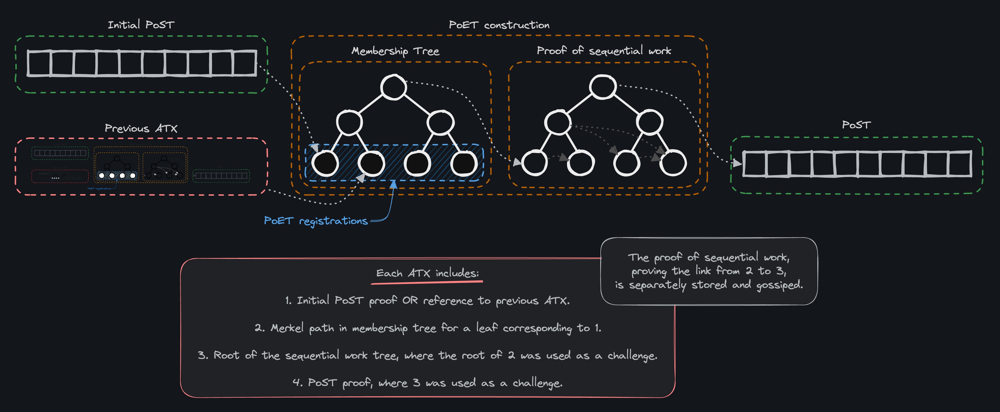
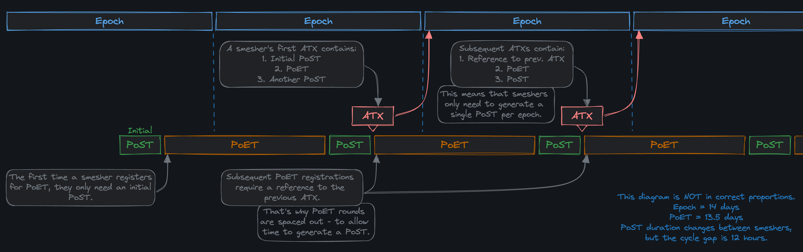
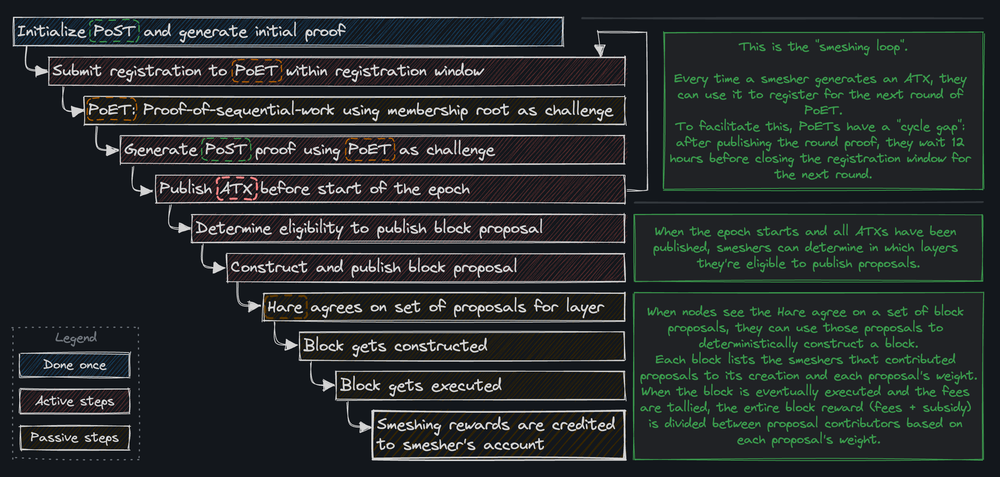

In short, smeshing is mining. Similar to Bitcoin and other public blockchains, smeshing is the process of dedicating scarce resources to the network in exchange for eligibility to produce proposals and earn rewards.

At a high level, mining in Spacemesh works like it does on other blockchains: 

- Smeshers provably spend scarce resources in order to be eligible to participate in block production at certain points in time. 
- Smeshers are rewarded with coins for following the rules of the protocol and contributing to block production.
- Anyone found violating the network rules is punished.

However, unlike in other blockchains, the scarce resource committed to the Spacemesh protocol is _space-time_ (as opposed to hashing power in proof of work, or staked capital and time value of money in proof of stake), and multiple miners participate in the creation of each block.

### Protecting the Network

The mechanism protecting Spacemesh from attackers taking over the network is based on smeshers [allocating space](./post.md/#proof-of-space) over a period of time. To be eligible for participation, and the rewards that come with it, one must prove that they have indeed held a claimed amount of storage over a period of time. Smeshers must publish an[ Activation Transaction](./atx.md) once per epoch (a period of two weeks) to certify that they are eligible to participate in the epoch following the upcoming one. The activation transaction contains cryptographic proof that the author had access to the allocated storage before and after a proven time span.

When a smesher completes the initialization of their allocated storage, they produce an [initial Proof of Space(PoS)](../). This only proves that the author had access to the PoS data at an undetermined point in time, but this proof is then timestamped by the [PoET (Proof of Elapsed Time)](./post.md/#proof-of-elapsed-time) service. The PoET construction has two main parts: a membership tree, showing that a given smesher had access to their PoST data prior to the PoET work and a Proof of Sequential Work, showing that a certain amount of sequential work has been performed - which Spacemesh uses as an approximation of time.

Once the proof of sequential work is complete, smeshers can use it as a challenge for another PoST - resulting in a chain that proves that the smesher had access to the data both before and after the sequential work.

The following simplified diagram illustrates the structure of an ATX:

## The Smeshing Loop

To prevent the need to generate, transmit and store two PoST proofs for every ATX, in all PoET registrations but the first smeshers include a reference to their previous ATX. Since the previous ATX includes a PoST and is included in the PoET membership tree, the smesher proves this way that they had access to the stored data before PoET work began.

To allow smeshers enough time to receive the PoET, generate a PoST (this step may take several hours), generate an ATX with both proofs and use it to register to the next PoET round - PoET rounds are spaced out. There is a 12-hour Cycle Gap between PoET rounds, which should be enough time for most smeshers to complete this process. To prevent smeshers from allocating more storage than they can create a PoST for in 12 hours, SMApp runs a benchmark and tells users what their maximum recommended allocation is as part of the smeshing setup process.

### Earning Rewards

Spacemesh rewards (made up of transaction fees + block subsidy) are distributed to smeshers who produce eligible block proposals in time for the Hare to include them in the final set used to generate a block. They’re allocated based on the relative weight of each proposal, which is derived from the weight of the smesher’s ATX that was published prior to the current epoch.

An eligible ATX includes two PoST proofs (or a reference to the previous ATX and a single PoST proof) tied together by a PoET proof, together proving that the smesher had access to the data before and after a certain amount of time (two weeks) passed.

The following graphic details all the required steps from initialization to receiving a reward:

