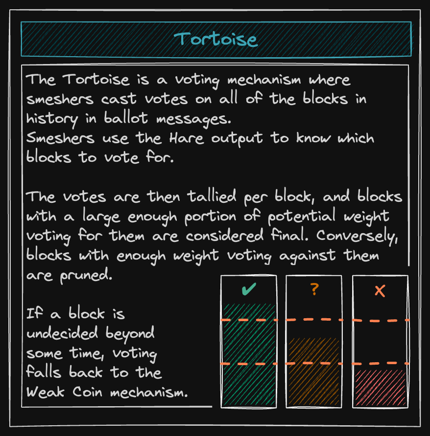

At the point that Tortoise begins, [Hare](./hare.md) has output a block for the current layer. All smeshers present in the network at the time of the Hare agreement know about this block and the fact that it has been agreed upon by the Hare committee. However, what if a smesher were to join later? How would a later participant know about the validity of older blocks and the entire block history? Even generally, how can we ensure the veracity and finality of older blocks as Hare only gives us the most recent blocks? This is where Tortoise comes in.

Tortoise is essentially a voting mechanism. The object of this voting is the block output by Hare and, consequently, all the blocks before it. This is to ensure that the network keeps voting on the correct blocks and block history so that any state change or transaction is final. This way, the older a block is, the more votes it accumulates, and the harder it becomes to change it as time goes on. In order to be able to participate in Tortoise, a smesher must first become eligible. This is done by publishing eligibility proofs inside ballots, which are published as part of the block proposals.
Ballots

A smesher’s eligibility to publish ballots in a layer is determined from the eligibility proof, which is included in the ballot. The eligibility proof, when calculated, yields the layer number in the current epoch in which the smesher is entitled to a ballot, whereas the ballot includes the eligibility proof and the encoded ids of the blocks for which the smesher is voting. Each block proposal includes the ballot in it and thus there are as many ballots per layer as block proposals. Currently, there are 50 ballots and 50 block proposals per layer.

The target number of ballots for an epoch is calculated by multiplying the total number of ballots required in a layer (50 at the moment) by the total number of layers in an epoch (4032 at the moment). This gives the network a target of 201,600 ballots per epoch. So, a single smesher will be eligible to a part of this target amount of ballots in proportion to their relative weight.
Ballot counting

Under normal circumstances, each ballot posted in a layer contains a reference to a ballot it agrees with from the previous layer, along with a reference to the block from the previous layer. Thus, as time goes on, more and more votes accumulate for these blocks in the past layers, thereby strengthening a single history more than any other.
In order to consider a block valid, Tortoise requires that it have more than ⅔ of the cumulative weight of the ballots voting for that block’s layer.


The node prints this message in the logs every time this process has started and fully synced:

```
2023-08-11T13:45:00.622-0400    INFO    abcde.proposalBuilder   proposal eligibility for an epoch       {"node_id": "abcde", "module": "proposalBuilder", "epoch_id": 2, "beacon": "e3e3389e", "weight": 141435, "min activeset weight": 5000000, "total weight": 305096691, "total num slots": 93, "num layers eligible": 93, "layers to num proposals": [{"layer": 8091, "slots": 1}, {"layer": 8179, "slots": 1}, {"layer": 8212, "slots": 1}, {"layer": 8215, "slots": 1}, {"layer": 8248, "slots": 1}, {"layer": 8306, "slots": 1}, {"layer": 8382, "slots": 1}, {"layer": 8389, "slots": 1}, {"layer": 8411, "slots": 1}, {"layer": 8432, "slots": 1}, {"layer": 8454, "slots": 1}...], "name": "proposalBuilder"}
```

In Smapp the same thing looks like this:


## Ballot counting

Under normal circumstances, each ballot posted in a layer contains a reference to a ballot it agrees with from the previous layer, along with a reference to the block from the previous layer. Thus, as time goes on, more and more votes accumulate for these blocks in the past layers, thereby strengthening a single history more than any other.
In order to consider a block valid, Tortoise requires that it have more than ⅔ of the cumulative weight of the ballots voting for that block’s layer.

## Voting and reward eligibility

A smesher would want to know which layers in the current epoch are they eligible to vote (i.e, post a ballot) in. For this, they must calculate an eligibility proof which is included in the ballot.

To calculate the eligibility proof, first, a message is created using the smesher’s ID, the epoch number, the eligibility index (starts from 0 until the maximum number of eligibilities the smesher is eligible for in this epoch), and a beacon value (a random value unknown to the smesher in advance). This message is then signed by the smesher’s private key, with the result then being calculated modulo 4032. This modulus operation is performed so that the result, which is the layer number, is within 4032 as it cannot be more than the maximum number of layers in an epoch. The eligibility proof is calculated as many times as the number of ballots which the smesher is eligible to vote for in an epoch, and each time the output is the layer in which the smesher is able to vote.

As an example, if a smesher is eligible for a ballot 8 times in this epoch, the calculation will run 8 times (with index values from 0 to 7) and output 8 different layer numbers. The smesher is then eligible for a ballot in each of these 8 layers. Since the number of eligibilities is directly proportional to a smesher’s relative weight, the more weight (remember this is SU * PoET ticks) a smesher’s PoST has in an epoch, the more layers he is eligible to post a ballot in in an epoch.
