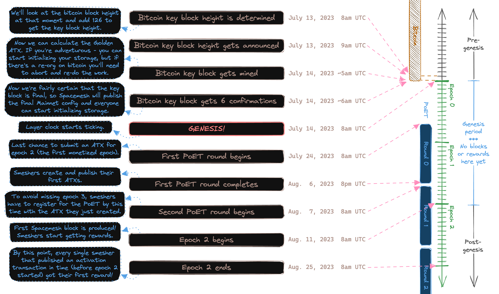

As described in the [PoST explainer](./../../../learn/poet.md), for its security, the Spacemesh protocol relies not only on committed _disk space_ but also on _elapsed time_ (the time dimension in the Proofs of Space-Time). For the time component, smeshers rely on a third-party service called a PoET server. 

Anyone can run their own PoET server, but this is non-trivial, expensive, and requires specialized hardware and DevOps. More importantly, a single PoET server can generate PoETs for thousands of smeshers. Given that the PoET server performs intensive, expensive computation on behalf of the smeshers it serves and a smesher only needs a single PoET proof for a given epoch, it is more efficient and less energy-intensive to run a small number of PoET servers than having each smesher run their own. In general, smeshers do not need to give much thought to PoET servers. The smeshing node (whether [running Smapp](../smeshing_basic/setup.md) or [`go-spacemesh`](../smeshing_adv/setup.md) directly) manages the process of discovering PoET servers, registering with them, and retrieving proofs when they are ready. A node is also intelligent enough to register with many PoET servers redundantly so that if one server goes offline, it will still be able to retrieve the PoET from another PoET server.

## Ticks and Weight

Smeshers establish eligibility to submit [block proposals](../../../learn/atx.md#block-proposals) and earn [rewards](../../../learn/rewards.md) by bundling their PoSTs into a special data structure known as an [Activation Transaction](../../../learn/atx.md)(ATX). Each ATX has a certain **weight** which is simply calculated as the number of Space Units (SUs) proven multiplied by the tick count from the PoET proof (ticks are used as a proxy for the passage of time). Rewards earned by a smesher in a given epoch are ultimately proportional to the weight of their ATX targeting that epoch. Thus, if a smesher uses a PoET with fewer ticks, it will earn proportionally fewer rewards for at least the duration of one epoch (the reverse is also true). Note that, in addition to retrieving PoETs from multiple PoET servers, the node is also intelligent enough to use the proof with the highest tick count to ensure that it maximizes its rewards.

## Timing

The Spacemesh team currently operates several PoET servers for public use and their addresses are hardcoded into the `poet-server` section of the mainnet node config file (for Smapp, `node-config.7c8cef2b.json`, for `go-spacemesh`, the file input as the `--config` CLI argument). All PoET servers operate on exactly the same schedule. In order to establish eligibility for epoch N, a smesher must register with a PoET server during the PoET round in epoch N-2. Afterwards, the node must retrieve the PoET proof, use it to generate a PoST proof, bundle this into an ATX, and submit it to the network prior to the end of epoch N-1 (all of this is done automatically by the node).

The Spacemesh PoET servers start a new round at **8:00 UTC, the second Monday of an epoch** (i.e., four days prior to the end of the epoch). Subsequently, there is a 12-hour **cycle gap** window during which no PoET round is running, and after which the next PoET round kicks off and the cycle repeats itself. During this 12-hour window, all smeshing nodes must retrieve their PoET from a PoET server, use it to generate a PoST proof, bundle this into an ATX, broadcast the ATX to the network, and then register with the PoET again in order to maintain continuous eligibility.

To better understand the PoET generation and submission schedule, take a look at the figure below:



To better prepare for timely PoET submission, you can use [this unofficial calendar](https://calendar.google.com/calendar/u/0/embed?src=8895d862c4a9ac22c8da2dafd9c618cd47e5c2d22905f920b1231a3b02aacd62@group.calendar.google.com). To reiterate, in most cases, smeshers do not need to concern themselves with the PoET schedule since their node will handle everything for them. The most important thing is that the node remains running and online throughout the epoch so that PoET generation windows are not missed and continuous eligibility is maintained. 

In the future, it is likely that instead of all PoET servers running in identical phases, there will be PoET servers running in different phases, possibly also with different cycle gap lengths. This would be to accommodate smeshers that need more time to generate a PoST or who simply miss a PoET registration window.

## Running a PoET Server

As with the rest of Spacemesh infrastructure, the PoET server is [open source](https://github.com/spacemeshos/poet) and
permissionless. Anyone may run their own PoET server for personal or community use. For more information, see the [PoET
Operator Manual](https://github.com/spacemeshos/poet/blob/develop/docs/poet_operator_manual.md) and feel free to ask
questions in the [#poet channel](https://discord.com/channels/623195163510046732/1151165793590050867) on Discord.

## Updating the Node Configuration to Use Different PoET Servers

Smeshers are free to use any PoET server they want. Multiple PoET servers can be added to the existing list of PoET
servers in the [node configuration file](../smeshing_basic/advanced_config.md) or can even completely replace another
set of PoET servers.

Adding a PoET server with the same phase as the one being used by the smeshing node is simple:

1. Stop the node.
1. Update the configuration by adding the new PoET server to the list of existing servers (and remove any you do not
   wish to use).
1. Start the node again.

When the next PoET round starts, the node will start using the new set of PoET servers as per the updated configuration.

### Switching Phase

If you wish to switch to one or multiple PoET servers that operate on a different phase than the default set of PoET
servers ensures that your node and the PoET server(s) you are using have the following configuration parameters set to
the _same values_:

- `"phase-shift"`: The time (relative to the beginning of an epoch) when a new PoET round starts. For the default set of
  PoET servers, this value is **240 hours**. Lower values mean that the nodes starting to use the PoET server have to
  wait longer before they become eligible to collect rewards, while higher values mean that nodes have less time after
  fetching a PoET to publish their ATX to be eligible to collect rewards.
- `"cycle-gap"`: The time between the end of a PoET round and the start of a new one. Larger values give nodes more time
  to generate a PoST - since this has to happen within the cycle gap to not miss an epoch. Smaller values give the PoET
  server more time to generate the PoET and collect more ticks. For the default set of PoET servers, this value is **12
  hours**.

You should also ensure that any custom PoET has the same `"genesis-time"` and `"epoch-duration"` properties as the
mainnet (`"2023-07-14T08:00:00Z"` and 336 hours, respectively).

**Note**: Switching to an earlier PoET phase than your node is currently using will result in your node missing one
epoch of rewards. This is because you **must not** register at a PoET of a different phase and then try to use the PoET
from the previous phase to generate a PoST. Doing this would allow you to accumulate ticks from two PoETs at the same
time, which is not allowed and will result in your node being disqualified.

Switching to a later PoET phase however is possible without missing rewards if done correctly.

For step-by-step instructions, follow the guide below.

### Timing a Phase Switch

Switching phase bears the risk of missing a PoET round and thereby forfeiting your eligibility to collect rewards in an
upcoming epoch. To mitigate this risk, you should properly time your phase switch and follow these steps:

1. Wait until the end of the PoET round of the phase you are currently using. If you are using the default PoET servers,
   this would be every second Sunday of the month at 20:00 UTC.
1. Your node will fetch the PoET(s) from all the PoET servers it successfully registered for.
1. Wait until your node has finished generating a PoST and has published an ATX (check the logs for `ATX published`).
1. Stop the node.
1. Update your node configuration by replacing the PoET server(s) in your node config file with the new one(s). Ensure
   that all the PoET servers you are using have the same phase and cycle gap values and update the `"phase-shift"` and
   `"cycle-gap"` properties in your node config file accordingly.
1. If you do not have sqlite installed on your system, install it:
    1. On Windows, you can download it from [here](https://www.sqlite.org/download.html) (you will need
       `sqlite-tools-win-x64`).
    1. On Ubuntu, you can install it via the terminal with `sudo apt install sqlite3`.
    1. On macOS, you can install it via the terminal with `brew install sqlite3`.
1. Delete the contents of the `poet_registration` and `nipost` tables using the following terminal commands:

    ```bash
    > sqlite3 <node_config_directory>/node_state.sql
    sqlite> delete from poet_registration;
    sqlite> delete from nipost;
    sqlite> .quit
    ```

1. Start the node again.

If the new phase has not started yet, your node will register with the new PoET(s) immediately and fetch a PoET in time
to be eligible to collect rewards in the next epoch. If, by the time you have restarted your node the new phase has
already started, your node will register with the new PoET servers in the next epoch and you will miss one epoch of
rewards (the epoch after the next one).

**Note**: Before `go-spacemesh` v1.3.x, PoET registration state was stored in a file called `nipost_challenge.bin` and
`nipost_builder_state.bin` inside the node's PoST data directory. If you are using a node version older than v1.3.x (not
recommended, always use the latest version), you will have to delete these files instead of the sqlite tables (steps 6
and 7).
