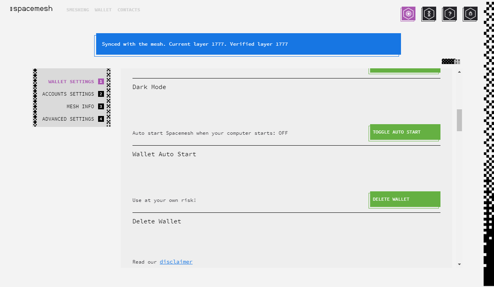

# Toggling Dark Mode and Auto Start

The Spacemesh App includes settings that can be toggled in order to alter your user experience, including `DARK MODE` and `AUTO START`.

You can access these settings by navigating to the `SETTINGS` screen and scrolling down to `DARK MODE` and `WALLET AUTO START`.

