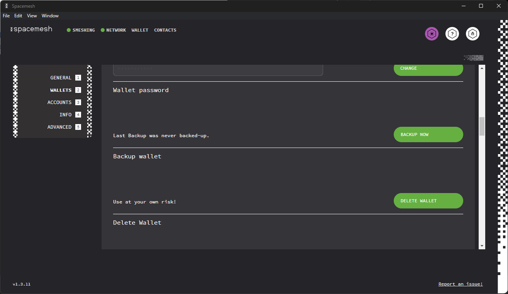
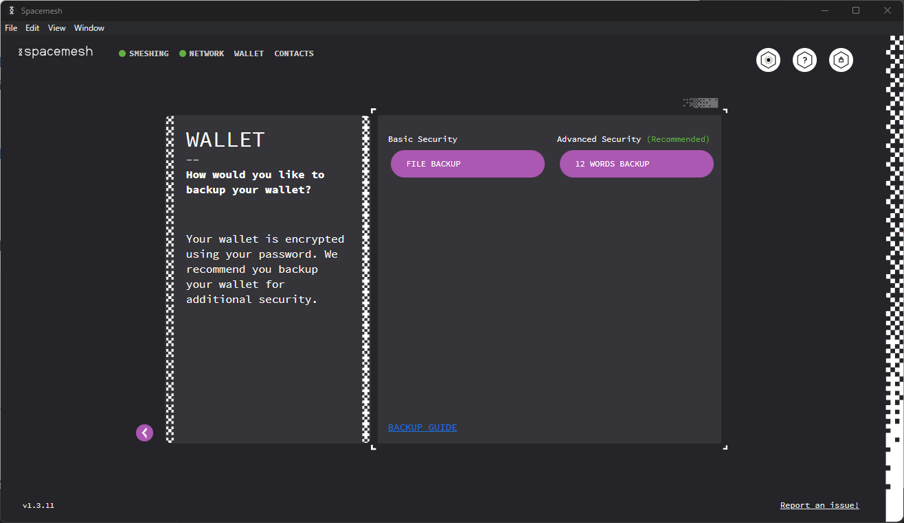
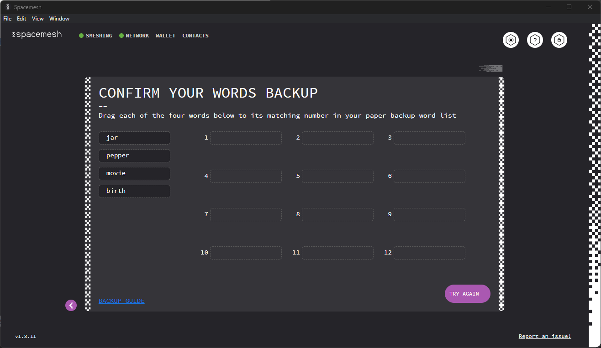
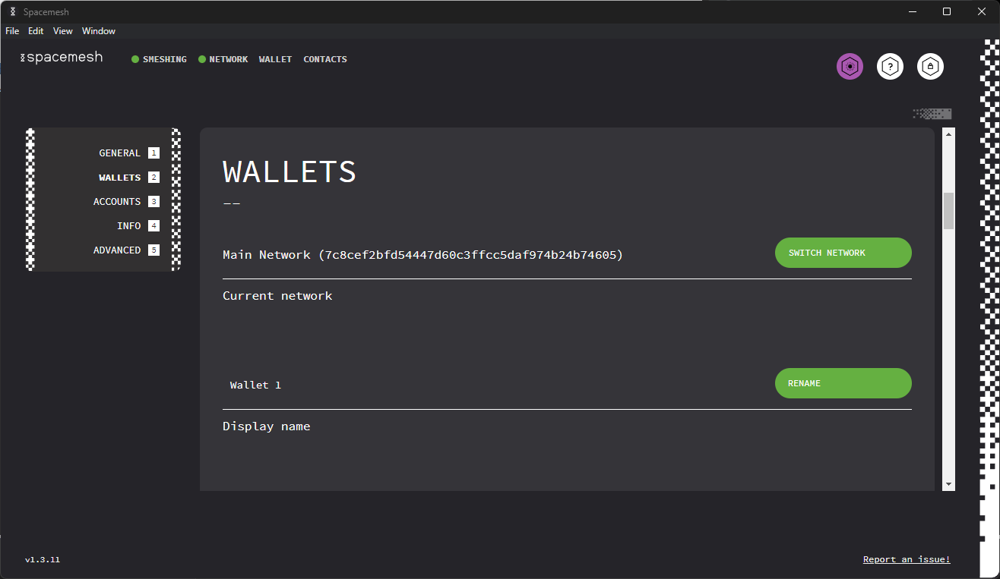
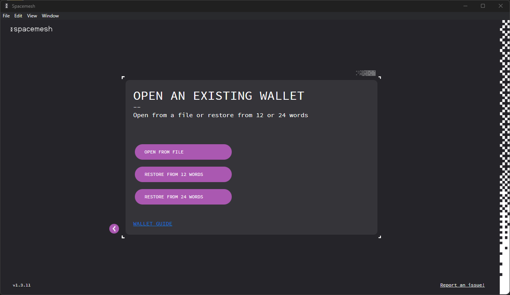
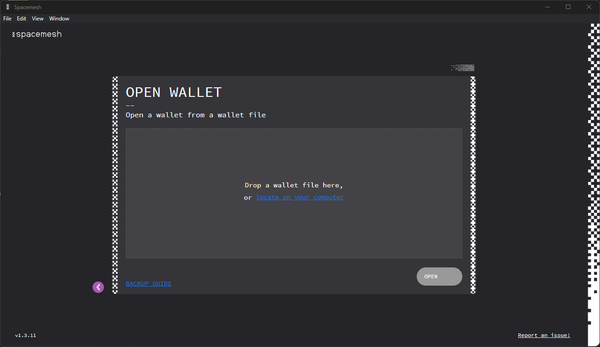
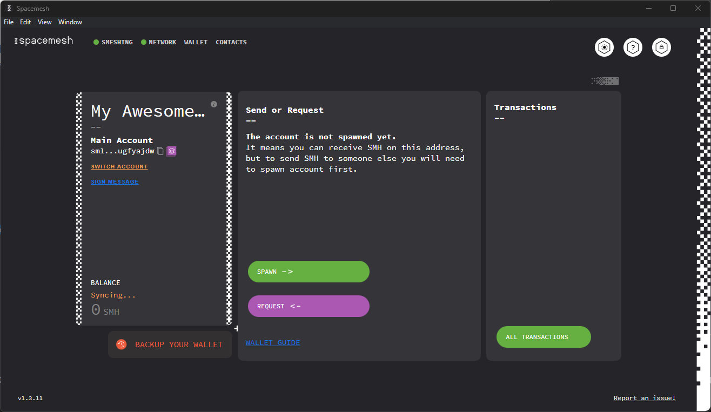
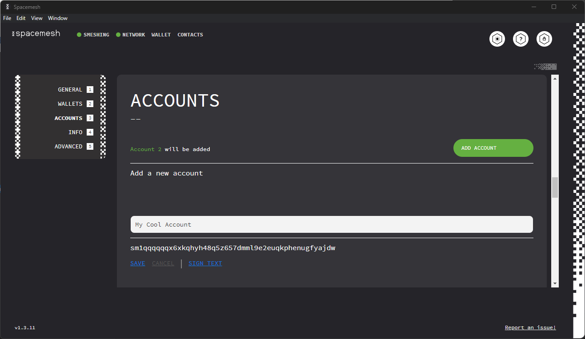
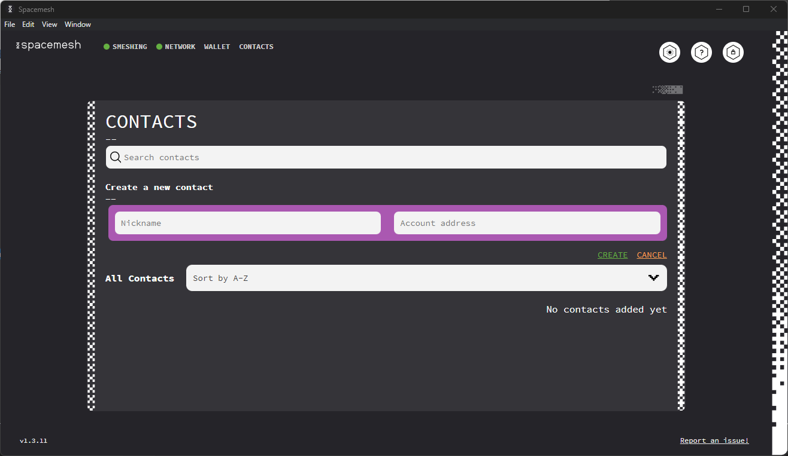

## Backing up

There are three ways to get to the Wallet Backup Screen:

### OPTION 1

From the main screen. Note that until the first backup is done, there will be an alert under the “BALANCE” section saying “BACKUP YOUR WALLET”.

### OPTION 2

In the top right corner of the main screen, there is the `SETTINGS` button. After navigating to the settings, find the `WALLETS` option in the left menu, then scroll down until you see the **Backup Wallet** section. Once there, click the `BACKUP NOW` button.

Now, you are at the Wallet Backup Options screen:

At this stage, you will have two ways to back up your wallet: **File Backup** and **12 Words Backup**.

#### File Backup

Click on the `FILE BACKUP` button and you will be taken to the file backup screen:

Clicking on the `Browse file location` button will open a file browser window with the Wallet backup file selected. The file is saved in the “Documents” folder by default but can be moved to any other folder or the ledger wallet.

#### Option `MNEMONIC BACKUP`

Click the `MNEMONIC BACKUP` button and you will be taken to the mnemonic backup screen:

These 12 words can be used to restore your Wallet anywhere using Spacemesh software. They are also referred to as **seed** or **seed words**. By clicking the `PRINT WORDS` button, a standard print window will open, allowing you to either save the words as a PDF on your computer or print them on paper.

The other button is `COPY WORDS`. This option is useful if you want to save the words in some kind of encrypted file or vault. After clicking the `COPY WORDS` button, you will see a message in green confirming that the words have been copied to the clipboard.

Use any of the above two options to create a backup of your wallet. Once done, clicking `NEXT` will take you to the confirmation screen.

#### Confirmation Screen

On the confirmation screen, you can practice restoring the 12 words in the right order by dragging and dropping the randomly selected 4 words in the right places. 

If you manage to place the words in the right order, you will be able to click `DONE` and will be returned to the Wallet screen. However, if you fail to do so, the following message will be shown beside the `TRY AGAIN` button:

## Rename Wallet

Click on the `WALLETS` option in the left pane and scroll down until you see the **Display Name** section:

After clicking on the `RENAME` button, you will be allowed to enter a new name for the wallet.

After typing in the new name, click the `SAVE` button or `CANCEL` to leave the name unchanged. If you clicked `SAVE`, you will see that your Wallet has the new name:

## Changing Wallet Password

Go to the Settings screen and click on the `WALLETS` option in the left pane. Then, scroll down until you see the **Wallet Password** section:

Click on the `CHANGE` button and the password line will switch to three inputs: one for confirming your old password, one for typing in new the password, and one for confirming your new password:

If you wish to proceed with changing the password, click `SAVE`. If not, click `CANCEL`. If you clicked `SAVE`, your Wallet password will be updated to the new password.

## Restoring a wallet

There are 3 options to restore wallet:

### OPTION 1

Upon opening Smapp, at "Unlock Wallet" screen, there is an `OPEN AN EXISTING WALLET` button below the password input field:

Clicking on it will bring you to a screen presenting you with three options for restoring your wallet:

### OPTION 2

If you have an unlocked wallet, go to Settings Screen and click on the `WALLETS` option in the left pane. Then, scroll down until you see **Open Wallet** section where you will be greeted with three options:

Regardless of which option you choose, the following steps will be the same:

#### Restoring Wallet from File

After clicking on `OPEN WALLET FILE` you will be directed to this screen:

You can drag and drop your file in the designated area or click on `locate file on your computer`. Click the `OPEN` button at the bottom-right of the screen and you will be asked to confirm the Wallet import. Click `CONFIRM`.

Next, you will be prompted to enter your password. After doing so, you will be taken to the Wallet screen.

#### Option B: 12- or 24-Word Restore

The method for restoring from 12 or 24 words is the same. Thus, we will demonstrate restoring the Wallet using 12 words. After clicking on the `12 WORDS RESTORE` button you will be directed to this screen:

If you have typed the correct words in the correct order, you will be prompted to set up a new wallet.

## Adding an Account

Go to the Settings screen and click the `ACCOUNTS` option in the left pane. After doing so, you should see an `ADD ACCOUNT` button.

After entering the correct password, the popup will disappear and you will be taken to the Wallet screen. You will now see the option to switch accounts. The default name for the created account is “Account `number`”.

## Renaming a Wallet

Go to Settings ccreen and click on the `WALLETS` option in left pane. Scroll down until you see the account that you want to rename. Beside the account name, you will see the `RENAME` button:

After clicking the `RENAME` button, you will be able to enter a new name for the account:

After typing the new name, click `SAVE` to save. To discard changes, click `CANCEL`. If you click `SAVE`, you will see your new Wallet name:

## Renaming an Account

Go to the Settings screen and click on the `ACCOUNTS` option in the left pane. Scroll down until you see the account that you want to rename. Below the account name, you will see the `RENAME` button.

After clicking the `RENAME` button, you will be able to enter a new name for the account:

After typing the new name, if you want to save it, click `SAVE`. To discard the changes, click `CANCEL`. If you clicked `SAVE`, you will see a popup asking you to enter the Wallet password. After entering the correct password and clicking the `UNLOCK` button in the popup, the popup will disappear and you will see the renamed account.

## Creating Contacts

In order to create a new contact, go to the `CONTACTS` tab and click the `CREATE NEW CONTACT` button.

You will then be allowed to enter the contact nickname and address:

After filling in the details and clicking the `CREATE` button, you will see a popup asking you to enter the Wallet password. After entering the correct password and clicking the `UNLOCK` button, you will see the newly created contact in your contacts list:

