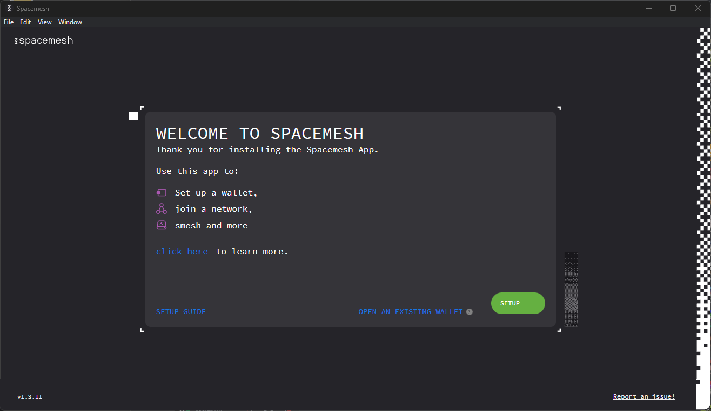
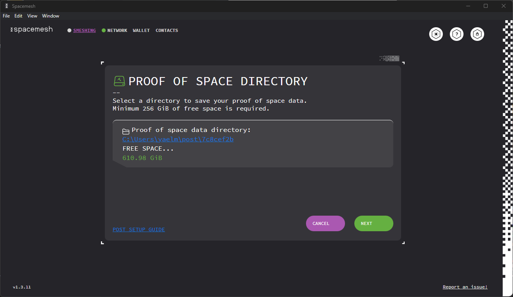

## Step 1 - Setting up a Wallet

Follow the installer's on-screen instructions and proceed to launch Smapp. You should now see this welcome screen:

Let us now proceed to set up the Wallet and the smeshing node. But first, some definitions.

### About the Wallet

A Wallet holds one or more Spacemesh accounts. An account is identified by a long, unique hexadecimal number (e.g., `0x20a5...3a1f`). It enables you to send and receive SMH (you have to spawn your account first to send coins), and in the future, will also allow running decentralized applications (dapps) built on Spacemesh. 

Each account has a balance of SMH coins. You can send SMH from your account up to your coin balance. So, for example, if your account coin balance is 10 SMH then you can send up 10 SMH (minus transaction fees) from it to other accounts.

> A Spacemesh smeshing node is called a **Smesher**

> The process of producing blocks is called **Smeshing**

Your wallet's main account will be used as your smeshing node's rewards account and you will receive your rewards to in account. Let's set up a new Wallet to manage your SMH coins.

---

After opening Smapp, click `SETUP` to start the setup process. The next screen should look like this:

Click **WALLET + NODE**. Next, you will be asked to select your Wallet type. At present, you can only select `STANDARD WALLET`.

then, you will need to choose the network. The Spacemesh main network is selected by default. Click `NEXT`.

From here, you will be prompted to back up your Wallet mnemonically with either 12 or 24 words. After selecting one, you will create your password before being taken to the backup words.

> You will need to use the newly created password to access your Wallet. We recommend saving the password in a password manager such as [1Password](https://1password.com).

> Until you back up your Wallet using the 12 or 24-word mnemonic backup method, you will not be able to access it without your password. _There is no way to restore a Wallet that was not backed up and the password has been forgotten._

Click `NEXT`. You will be taken to your backup words. We recommend both printing them and saving them in a file.

You will need to confirm your 12 or 24 words by dragging the provided words into the correct slots.

You will now be able to **`Go to Wallet!`**

## Step 2 - Setting Up Your Smesher

### About Smeshing

Spacemesh uses a [novel consensus protocol](../../../learn/post.md). Instead of constantly solving computational puzzles with your CPU while you participate in a blockchain, as in Proof of Work, Spacemesh utilizes the free space on your hard drive, following a [one-time setup phase](../../../learn/post.md#proof-of-space).
The storage space you commit to Spacemesh is attached to your identity on the Spacemesh decentralized ledger. It determines your eligibility to submit blocks with transactions to the Spacemesh network and to receive rewards for your contribution. **The more free disk space you commit, the higher the rewards you get.**

This one-time storage commitment enables Spacemesh to reach consensus on a distributed ledger without using Proof-of-Work or Proof-of-Stake algorithms.

> The free space that you allocate is not used to store any useful data. It will be filled with cryptographic data that is only used to establish your node identity and your smeshing eligibility.

Click on the `SMESHING` tab in the top left of Smapp. This will take you to the Smeshing screen.

Click `SETUP PROOF OF SPACE`.

You need to specify the directory where you want Smapp to save your [Proof of Space (PoS) initialization data](../../../learn/post.md#generating-the-data).

Click `Select Folder` and locate a directory on one of your hard drives. Click `NEXT`. You will now need to select your PoS generation Settings.

You can either go with the default settings, input custom settings which you can test with `TEST CHOSEN OPTIONS`, or run benchmarks to see which settings are best for you. To do this, click `RUN ALL BENCHMARKS`.

It will take a few moments for the process to complete, after which you will see several options to select, with the estimated PoS generation speeds. After selecting one of the benchmarked options, or inputting values of your own, click `NEXT`.

Select the amount of free space you would like to commit to smeshing and click `NEXT`. Note that space is calculated in Space Units (SUs) of 64GiB, with the minimum commitment being SU x 4 (256GiB).

> The more storage space you allocate to smeshing, the higher your rewards will be. However, beware: the PoS initialization process is long and resource-intensive. As such, make the appropriate decision given your circumstances and after considering the trade-offs of going with a larger PoS size (long initialization time, more rewards) vs. going with a smaller PoS size (short initialization time, lesser rewards). Do note that the PoS initialization is a one-off process unless you decide to change the PoS data size (increase or decrease it) later.

The following screen will prompt you to choose your preferred method of PoS data generation. Make sure that you have access to a GPU as PoS generation with CPU is quite slow and not recommended.

Once you have chosen, click `NEXT`. You will be prompted to select your coinbase (where you receive your rewards) account. If you have not yet created additional accounts, your main account will be your only option.

This will bring you to a confirmation screen. If everything is as per your liking, click `CREATE DATA`.

And finally, you should end up here:

Click `GOT IT`.

The one-time storage commitment setup process has now begun. Expect this process to affect your computer's performance. If need be, it can be paused and resumed.

---

### Disable Computer Sleep Mode

To finish the one-time PoS generation process and have your smeshing node participate in the Spacemesh protocol so you can earn `Smeshing rewards`, **you need to make sure that your desktop computer does not go to sleep or hibernate**.

## Windows 10

1. Type `Power` in the taskbar search box and click on `Power and sleep settings` in the results.
2. Navigate to the drop-down titled `When plugged in, PC goes to sleep after` and select `Never` from the drop-down.

## Windows 11

1. Type `sleep` in the taskbar search box and click on `Change when the PC sleeps when plugged in` in the results.
2. In the settings window that opens, scroll down and click on `Power`.
3. In the new window, click `Screen and sleep`.
4. In the newly visible drop-down menu titled `When plugged in, turn off my screen after`, select the `Never` option.

## OS X

1. Open the `System Preferences` control panel and click on `Energy Saver`.
2. Click on the `Power Adapter` tab if you see one.
3. Check the checkbox labeled `Prevent computer from sleeping automatically when the display is off`.

## Linux

Please refer to the Power Settings, Hibernation and Sleep topics in your Linux distribution documentation. Change these settings to ensure that your computer never sleeps or hibernates.
