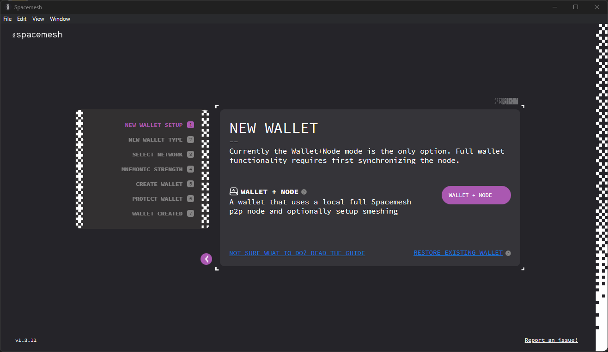
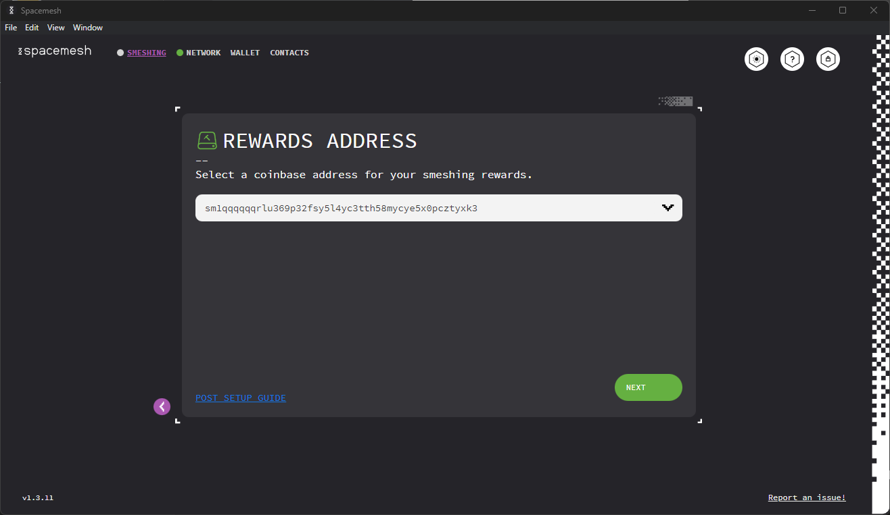
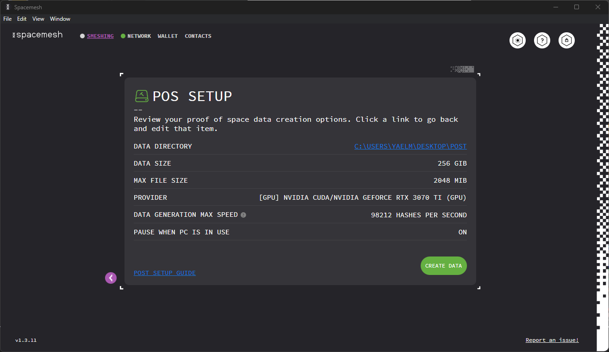

## Step 1 - Setting up a Wallet

Follow the installer's on-screen instruction and proceed to launch the App.

You should now see this welcome screen:

Let's now proceed to set up the Smesher, Smeshing, and the Wallet. But first, some definitions.

## About the Wallet

A Wallet holds one or more Smesh accounts. An account is identified by a long, unique hexidecimal number, such as `0x20a5...3a1f`.

The Wallet enables you to send and receive Smesh, and in the future, it will enable you to run decentralized applications (dapps) built on Spacemesh. Each account has a balance of Smesh coins (SMH).

You can send SMH from your account up to your coin balance. So for example, if your account coin balance is 10 SMH then you can send up 10 SMH from it to other accounts by executing transactions.

?> We call the Spacemesh full p2p node a _Smesher._

?> We call the process of producing blocks _Smeshing._

Your wallet's main account will be used as your Smesher's rewards account. You will receive rewards to this account.

Let's now set up a new wallet to manage your Smesh.

---

Click on `SETUP` to start the setup process.

The next screen should look like this:

Click **WALLET + NODE**

Next you will be asked to select your wallet type. At present, you can only select the Standard Wallet.

Now you will need to choose the network. Our main network is selected by default.

Click `NEXT`.

From here, you will be prompted to back up your wallet mnemonically with either 12 or 24 words. After selected one, you will create your password before being taken to the backup words.

> You will need to use the newly-created password to access your Wallet after you have locked access to the App. We recommend saving the password in a password manager, such as [1Password](https://1password.com).

> Until you back up your Wallet using the 12 words backup method, you will not be able to access it without your password. **There is no way to restore a wallet that wasn't backed up, if the password has been forgotten.**

Click `NEXT`. You will be taken to your backup words. We recommend both printing them and saving them on a document.

You will need to confirm your 12 words by dragging the provided words into the correct slots.

You will now be able to **Go to Wallet!**

## Step 2 - Setting Up Your Smesher

## About Smeshing

Spacemesh uses a novel consensus protocol. Instead of constantly solving computational puzzles with your CPU while you participate in a blockchain, as in Proof of Work, it utilizes free space on your hard drive, following a one-time setup phase.

The storage you commit to Spacemesh is attached to your identity on the Spacemesh decentralized ledger. It determines your eligibility to submit blocks with transactions to the Spacemesh Testnet and to receive rewards for your contribution. **The more free disk space you commit, the higher the rewards.**

This one-time storage commitment enables Spacemesh to reach consensus on a distributed ledger without using Proof-of-Work or Proof-of-Stake algorithms.

> The free space you commit to your Smesher is not used to store any useful data. It will be filled with cryptographic data that is only used to establish your node identity and your block Smeshing eligibility.

Click on `SMESHING` in the top left of Smapp. This will take you to the Smeshing screen.

Click `SETUP PROOF OF SPACE`

You need to specify the directory that you want Spacemesh to save your PoST init file.

Click `Select Folder` and locate a directory on one of your hard drives. Click `NEXT`.

You will now need to select your POS Generation Settings.

You can either go with the default settings, input custom settings which you can test with `TEST CHOSEN OPTIONS`, or run benchmarks to see which settings are best for you. To do this, click `RUN ALL BENCHMARKS`.

It will take a few moments for the process to complete, after which you will see several options to select, with estimated generation speeds.

After selecting one of the benchmarked options, or inputing a value of your own, click

Select the amount of free space you would like to commit to Spacemesh and click `NEXT`. Note that space is calculated in Space Units of 64GiB, with the minimum commitment being SU x 4, AKA 256GiB.

> The more storage you allocate for Spacemesh on your drive, the higher your Smesh rewards will be. But beware: the Initialization process is long and resource-intensive, so it's up to you to decide the tradeoffs!

The following screen will prompt you to choose your preferred method of POS data generation.

Once you've chosen, click `NEXT`. You will be prompted to select your coinbase account. If you haven't yet created additional accounts, your main account will be your only option.

This will bring you to a confirmation screen. If everything is as you like it, click `CREATE DATA`.

And finally, you should end up here:

Click `GOT IT`.

The one-time storage commitment setup process has now begun. Expect this process to affect your computer's performance. If need be, it can be paused and resumed.

---

### Disable Computer Sleep Mode
To finish the one-time Smeshing process and have your Smesher participate in the Spacemesh protocol so you can earn `Smeshing rewards`, **you need to make sure that your desktop computer does not go to sleep or hibernate**.

## Windows 10

1. Type `Power` in the taskbar search box and click on `Power & sleep settings` in the results.
2. Navigate to the drop-down titled `When plugged in, PC goes to sleep after` and chose `Never` from the drop-down.

## OS X

1. Open the `System Preferences` control panel and click on `Energy Saver`.
2. Click on the `Power Adapter` tab if you see one.
3. Check the checkbox labeled `Prevent computer from sleeping automatically when the display is off`.

---

## Linux

Please refer to the Power Settings, Hibernation and Sleep topics in your Linux distribution documentation.
