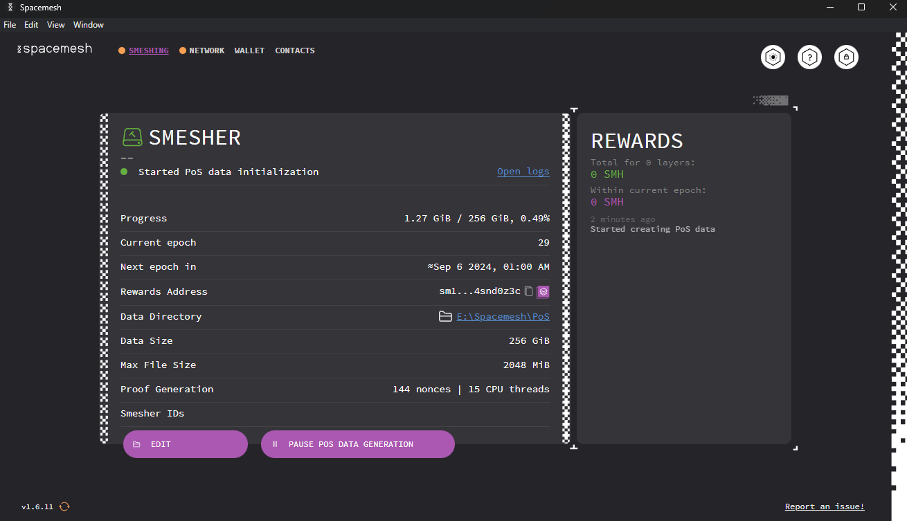

Smeshing is the process of submitting blocks with transactions to the Spacemesh network according to the Spacemesh protocol. Before you can smesh, you need to commit free storage on your computer hard drive to Spacemesh.

## Running a Local Full Node

In order to start smeshing, you must first run a full Spacemesh p2p node. When running Smapp for the first time, you will be prompted to set up a node. Click **WALLET + NODE**.

## Setting up Proof of Space (PoS) from Smeshing Screen

If you started Smapp in wallet-only mode and you want to start smeshing, you need to configure the PoS generation settings. First, you have to select the directory where the initialized PoS data will be stored. At this moment, the minimum free space required is 256 GiB. Smapp automatically selects a directory for you, but you can change it by clicking on the directory link (`E:\Spacemesh\PoS` in the image below).

Once you have selected the directory, click **NEXT** to continue. The next screen will allow you to run the profiler tool that benchmarks the PoS generation capabilities of your system. Keep testing a combination of Nonces and CPU Threads until you get the desired combination with good performance. When testing Nonce values, be sure to increment or decrement them in multiples of 16. To better understand the benchmark and better interpret its results, read [this](https://github.com/spacemeshos/post-rs/blob/main/docs/profiler.md#how-to-interpret-the-profiler-output). 

The next step is to select how much free space we want to commit to smeshing. The more space you commit, the higher your smeshing rewards will be (but the PoS initialization process will also take longer). Input your desired amount of space in Space Units (1 SU = 64 GiB, with the minimum PoS data size being 4 SUs) and click **NEXT**.

Having decided the PoS data size, it is now time to select how you want to generate it. You can either use your GPU (if you have one) or your CPU. While you can choose any of the two options, it is highly recommended that you generate the PoS data with a GPU. Using a CPU will take too long and is also error-prone. Choose CPU only if you cannot possibly use a GPU. Once you make your choice, click `NEXT`. 

On this screen, you can select the account to which you want to receive your smeshing rewards. There will only be one account available if you have not created anymore. Select your address and click `NEXT`.

Then, Smapp will display a summary of the options chosen so far. If all is to your liking, click `CREATE DATA` to start the PoS initialization operation. If not, click `<` and go back to change the options chosen so far.

Finally, the PoS data is being created. Once this process is completed, Smapp will start smeshing automatically. 

> Leave the computer turned on 24/7 and ensure that it will not sleep or hibernate.

Read the displayed information carefully and click **GOT IT** to finish the setup.

## Viewing Smeshing Status

All the information related to the smeshing process can be seen by clicking on the **SMESHING** tab. There, you can view the node ID, the space allocated to smeshing, and the node status. If the node is working well, you will have the status: **Smeshing**. You can also pause the PoS generation by clicking the `PAUSE POS DATA GENERATION` button.

## Changing the Smeshing Setup

To change the smeshing configuration, click **EDIT**. On this screen, you can **Update PoS proving opts** (modify PoS options e.g., size) or **Stop smeshing and delete PoS data**. Simply click on the corresponding buttons (namely `UPDATE` and `DELETE DATA`).

In order to smesh again, you will have to restart the PoS data initialization process.

## Viewing Your Smeshing Rewards

To view the smeshing rewards you have received so far, go to the **WALLET** tab.

On the right of the screen, you will see the last transactions, including the smeshing rewards. If you want to see all the transactions, click **ALL TRANSACTIONS**

A new window with the log of the transactions will appear. On its right, you will see a daily, monthly, or yearly summary of the transactions. **SMESHED** refers to the smeshing rewards.

If you want to view a transaction in detail, you have to click on it and then the relevant information will be displayed.

