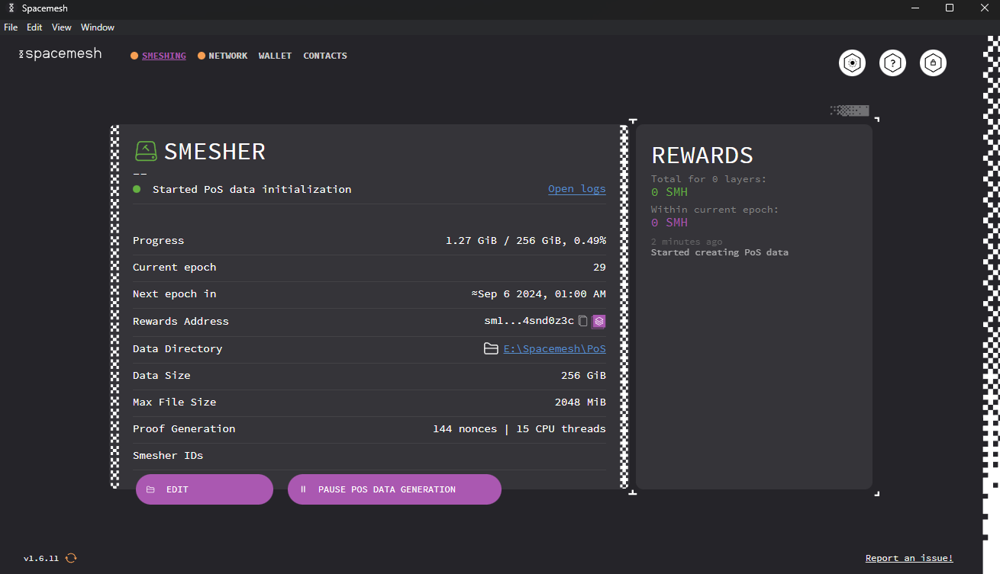
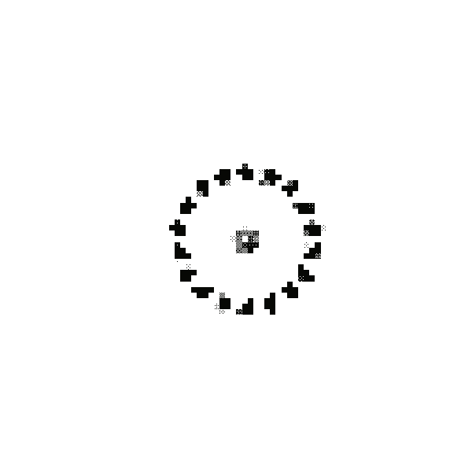

Open Smapp and click on the `SMESHING` tab in the top-left of the main window. You should now see the smesher status screen:

On this screen, you can view stats regarding your smeshing operation and earned rewards. You can also pause (or un-pause) your smesher by clicking on the `PAUSE POS DATA GENERATION` button.

### Closing Smapp

When you attempt to close Smapp, you will be prompted to either quit it entirely or let it run in the background. Choose `RUN IN BACKGROUND` so that your smesher will continue to run and smesh blocks.

### Smeshing Rewards Expectancy

> If you have committed storage and left your app running 24/7, and your network is [properly configured](./../netconfig.md), you should expect your first smeshing reward in about 49 hours, and subsequent rewards every 24 hours.

> Remember to leave your computer running 24/7 to fully participate in the Spacemesh protocol and accumulate smeshing rewards for your contribution!

## Well Done!

You did it - you are now running a smeshing node and will start receiving rewards for producing blocks on the Spacemesh protocol.

---
## Join the Spacemesh Community

Stuck? Need additional info? Got some cool ideas for the project?

- Participate in the conversation by joining our [Discord channel](https://discord.gg/Mf8T4Db).
- Follow [Spacemesh on Twitter](https://twitter.com/teamspacemesh).
- Learn more about Spacemesh at [spacemesh.io](https://spacemesh.io).
