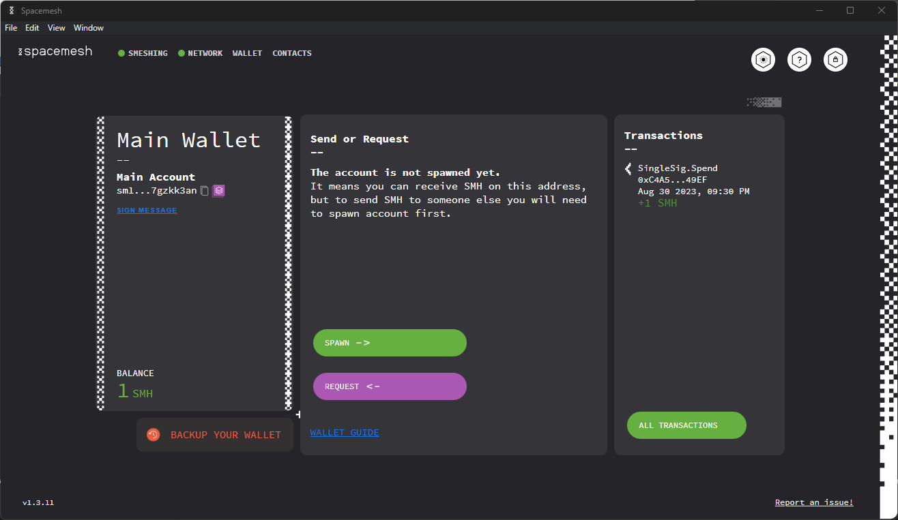
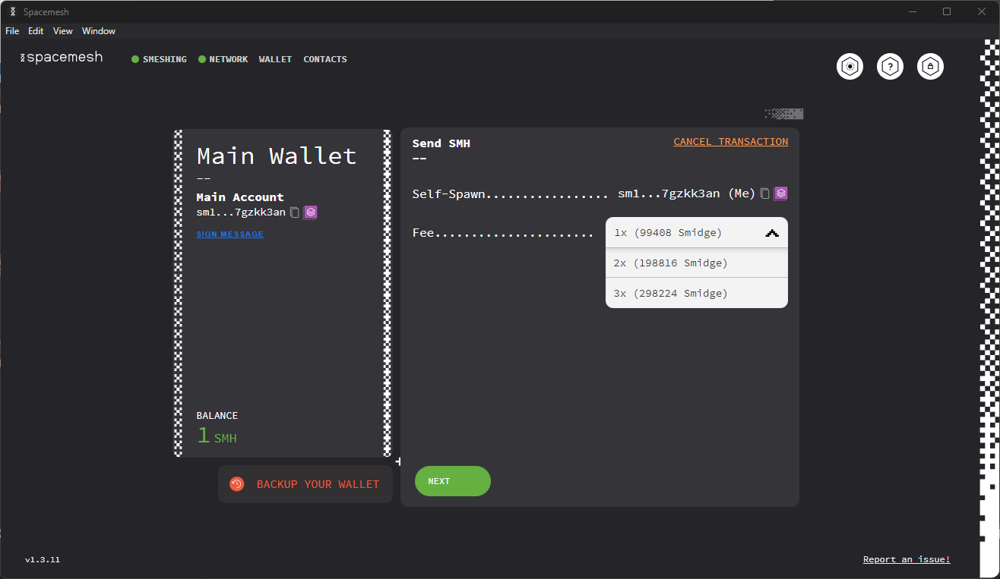
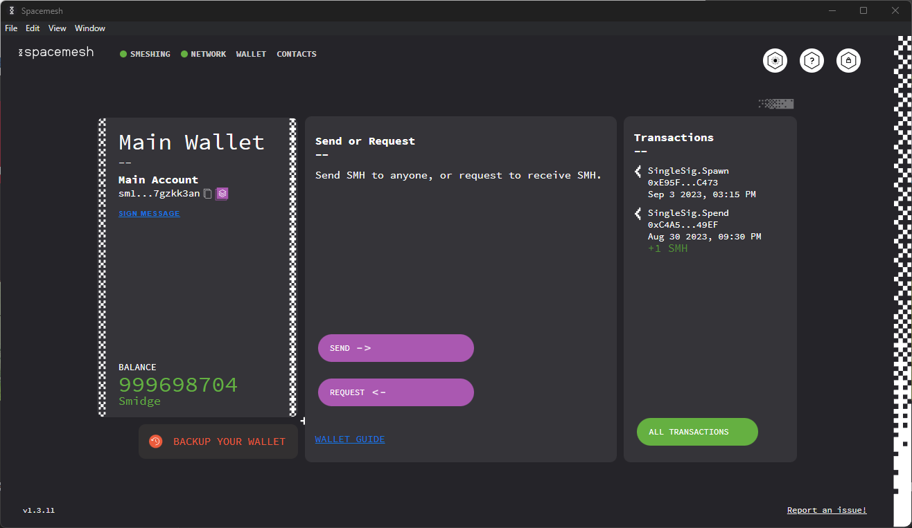
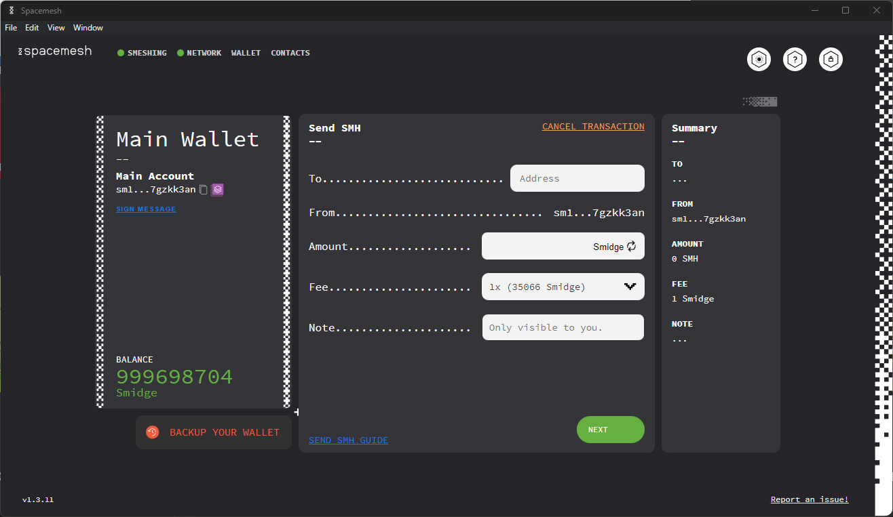
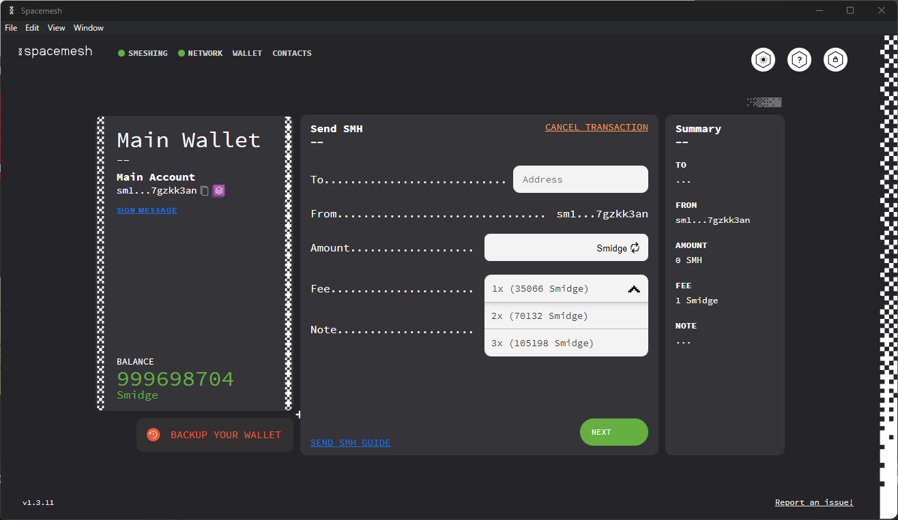
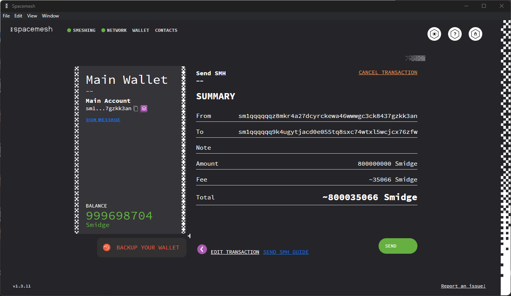
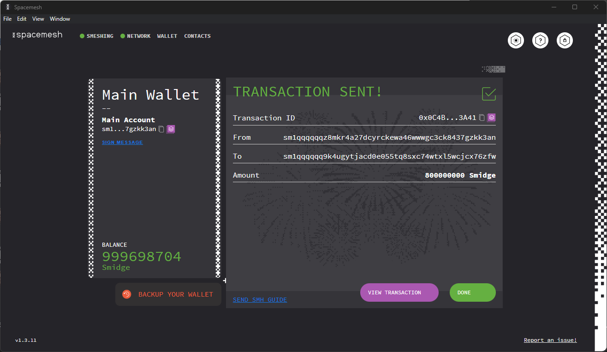
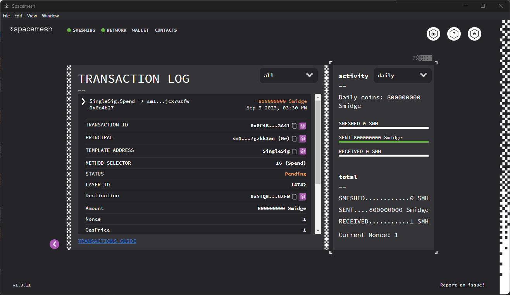
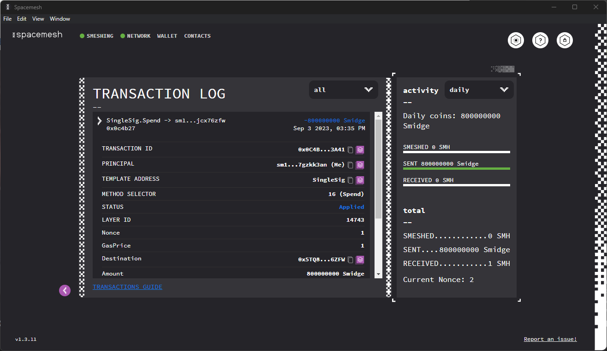

The Spacemesh App includes a Wallet for managing your Smesh.

Follow the instructions on this page to learn how to use your wallet.

## Accessing your Wallet

A new Wallet is created when you open the Spacemesh App for the first time.

You are prompted to secure your Wallet with a password, and we recommend that you store it in a password manager app, such as [1Password](https://1password.com).

> Your Wallet data is saved in a _wallet file_ (in JSON format) on your hard drive. The _wallet file_ includes sensitive private data that is encrypted in the file with your password.

When you open the Spacemesh App again you should see this screen:

Enter your Wallet password to unlock access to your wallet.

The Wallet data is loaded from the wallet file to the App and is decrypted using the password you provide.

> **IMPORTANT: you will lose access to your wallet if you forget your password.** For this reason, we recommend that you create a `12-word backup` as soon as possible. See how to back up your wallet in the [advanced wallet guide](advanced_wallet.md).

## Checking your Smesh Balance

After unlocking your Wallet, you should see the following screen:

The left side of the screen displays the Wallet info:

Your Wallet is configured with one main account called `Main Account`.

Think of this account as your crypto bank account. You use this account to hold SMH and to send and receive SMH coins.

Your account is identified by a unique _public address._ It is displayed under the account name in a short form that looks like this: `0xebee....ee0443`. Your full account address is a long hexidecimal number, such as `0xebee4e63a6b0f829f3ad06fb6c4aa80a6860774bc25e9c1b1b2c69b8b4ee0443`.

Your account balance is displayed at the bottom left side of the screen. SMH is the symbol for Smesh coin.

You can copy your account's public address to your computer's clipboard by clicking on the copy icon on the right side of the displayed  account number. This is useful if you want to receive SMH from another account holder. In this case, you just need to send the copied full account address to that person via any digital means, such as a text message or email.

## Spawning

In order to perform transactions, you must first spawn your wallet.

In order to do so, you must make sure that your account has enough balance to send the spawn transaction. At least 100 000 smidge will do.

Click the `SPAWN` button on your Wallet screen.

After this, select the spawning fee. The more expensive the fee, the faster the spawn.

Once your spawn transaction has completed, you will be able to perform other transactions.

## Sending Smidge

From your Wallet screen, click on the `SEND` button.

You should see the Send SMH screen:

Select the fee you will pay for the transaction. The higher the fee, the faster the transaction.

Paste the recipient's account address that he or she shared with you into the `Send to` field.

Enter the Smidge (1 trillionth of a smesh) amount you would like to send to the recipient in the `Amount` field.

> The amount must be less than your account's SMH balance, as you cannot spend coins that you do not have.

Click `NEXT`.

Review the transaction information in the summary screen:

Click `SEND` to execute the transaction.

You should now see this screen:

Click on `DONE`.

## Tracking your Transaction

Your recent transactions are displayed in the `Transactions` area of your Wallet Screen.

Click on `ALL TRANSACTIONS` to view the full transactions log.

Click on a transaction to view its details:

Notice the transaction status. A new transaction you just executed will be in the `PENDING` state and should move to `APPLIED` state once it has been added to the Spacemesh ledger. When pending, it will display the transacted amount in orange.

When applied, it will be displayed in blue:

