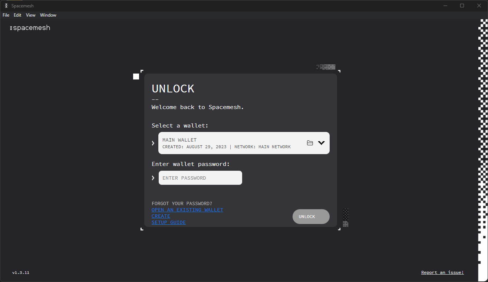

Smapp includes a Wallet for managing your Smesh. Follow the instructions below to learn how to use your Wallet.

## Accessing Your Wallet

A new Wallet is created when you open Smapp for the first time. You are prompted to secure your Wallet with a password, and we recommend that you store it in a password manager app, such as [1Password](https://1password.com).

> Your Wallet data is saved in a _wallet file_ (in JSON format) on your hard drive. The _wallet file_ includes sensitive private data that is encrypted in the file along with your password.

When you open Smapp again, you should see this screen:

Enter your Wallet password to access your wallet. The Wallet data is loaded from the Wallet file and is decrypted using the password you provide.

> **IMPORTANT: you will lose access to your Wallet if you forget your password.** For this reason, we recommend that you create a `12-word or 24-word backup` as soon as possible. See how to back up your Wallet in the [advanced Wallet guide](./advanced_wallet.md).

## Checking your SMH Balance

After unlocking your Wallet, you should see the following screen:

The left side of the screen displays the Wallet info. Your Wallet is configured with one main account called the `Main Account`. Think of this account as your crypto bank account. You can use this account to hodl, send, and receive SMH.

Your account is identified by a unique _public address._ It is displayed under the account name in a short form that looks like this: `0xebee....ee0443`. Your full account address is a long hexadecimal number, such as `0xebee4e63a6b0f829f3ad06fb6c4aa80a6860774bc25e9c1b1b2c69b8b4ee0443`. Your account balance is displayed at the bottom-left side of the screen.

You can copy your account's public address by clicking the copy icon on the right side of the displayed account number. This is useful if you want to receive SMH from another account holder. In this case, you just need to send the complete copied account address to that person via any digital means, such as a text message or email.

## Spawning

In order to perform transactions, you must first spawn your wallet. In order to do so, you must make sure that your account has enough balance to send the spawn transaction. At least 100 432 smidge ( smidge is 1 trillionth of a smesh) will do.

Click the `SPAWN` button on your Wallet screen.

After this, select the spawning fee. The higher the fee, the faster the spawn.

Once your spawn transaction has been confirmed, you will be able to perform other transactions using your account.

## Sending Smidge

From your Wallet screen, click on the `SEND` button.

You should see the Send SMH screen:

Select the fee you want to pay for the transaction. The higher the fee, the faster the transaction confirmation.

Paste the recipient's account address that he or she shared with you into the `Send to` field. Enter the amount (in smidge) you would like to send to the recipient in the `Amount` field.

> The amount must be less than your account's SMH balance as you cannot spend coins that you do not have.

Click `NEXT`.

Review the transaction information on the summary screen:

Click `SEND` to submit the transaction for execution and confirmation.

You should now see this screen:

Click on `DONE`.

## Tracking Your Transaction

Your recent transactions are displayed in the `TRANSACTION LOG` area of your Wallet Screen.

Click on `ALL TRANSACTIONS` to view the full transactions log. Then, click on a transaction to view its details:

Notice the transaction status. A fresh transaction that you just executed will be in the `PENDING` state and should move to `APPLIED` state once it has been added to the Spacemesh ledger. For pending transactions, the transacted amount will be displayed in orange. Once the transaction is applied to the ledger (i.e., confirmed), this amount will be displayed in blue:

Congratulations! You now know how to use your Spacemesh Wallet!